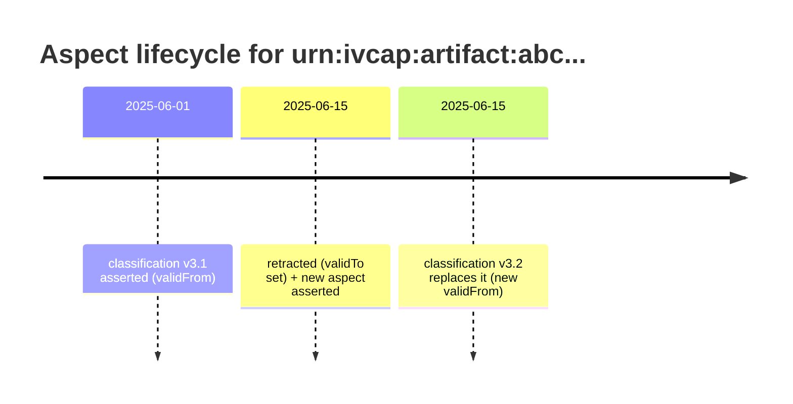

# Aspects and Provenance

An **Aspect** is a typed, time-stamped piece of metadata attached to any entity in IVCAP.
Aspects are the metadata currency of the platform: everything that happens — job submission,
artifact creation, status changes, domain annotations — is recorded as an aspect in the
[Data Fabric](data-fabric.md).

```
urn:ivcap:aspect:<uuid>
```

---

## The aspect data model

Each aspect is a tuple with the following fields:

| Field | Description |
|---|---|
| `id` | Unique URN for this specific aspect record |
| `entity` | The thing this aspect describes (service, job, artifact, or any other URN) |
| `schema` | URN of the JSON Schema that defines the shape of `content` |
| `content` | The actual metadata — a JSON document conforming to `schema` |
| `asserter` | The principal (user or service) that created this aspect |
| `policy` | Access policy governing who can read or retract this aspect |
| `validFrom` | Timestamp from which this aspect is considered true |
| `validTo` | *(optional)* Timestamp at which this aspect was retracted |

```json
{
  "id":         "urn:ivcap:aspect:1a2b3c4d-...",
  "entity":     "urn:ivcap:artifact:<uuid>",
  "schema":     "urn:ivcap:schema:my-domain:classification.1",
  "content": {
    "class":         "fire-risk",
    "confidence":    0.92,
    "model-version": "v3.1"
  },
  "asserter":  "urn:ivcap:account:<uuid>",
  "validFrom": "2025-06-01T10:00:00Z"
}
```

---

## Append-only: the "no update" rule

**Aspects are never deleted.** The platform never physically removes an aspect record. The
only modification allowed is setting `validTo = now`, which *retracts* the aspect — marking
it as no longer true from that point forward. A new corrected aspect is then created with
`validFrom = now`.



This append-only model means you can **query the state of any entity at any point in the
past**, which is the foundation of IVCAP's provenance guarantee.

---

## Creating and querying aspects

### Creating an aspect

=== "REST"

    ```json
    POST /1/aspects

    {
      "entity":  "urn:ivcap:artifact:<uuid>",
      "schema":  "urn:ivcap:schema:my-domain:classification.1",
      "content": {
        "class":      "fire-risk",
        "confidence": 0.92
      }
    }
    ```

### Querying aspects

=== "CLI"

    ```bash
    # All current aspects on an entity
    ivcap aspect list --entity urn:ivcap:artifact:<uuid>

    # Get a specific aspect by its URN
    ivcap aspect get urn:ivcap:aspect:<uuid>
    ```

=== "REST"

    ```bash
    # All current aspects on an artifact
    GET /1/aspects?entity=urn:ivcap:artifact:<uuid>

    # Aspects of a specific type on any entity
    GET /1/aspects?schema=urn:ivcap:schema:my-domain:classification.1

    # Historical query: what was known about this entity at a point in time?
    GET /1/aspects?entity=urn:ivcap:artifact:<uuid>&at-time=2025-06-01T00:00:00Z
    ```

### Retracting and replacing an aspect

```bash
# Retract (sets validTo = now)
DELETE /1/aspects/urn:ivcap:aspect:<uuid>

# Retract and replace in one operation
PUT /1/aspects/urn:ivcap:aspect:<uuid>
```

---

## Automatic provenance recording

IVCAP automatically records provenance aspects for every significant platform event —
you do not need to write any code for this.

| When | Schema | Content |
|---|---|---|
| Job submitted | `urn:ivcap:schema:order-placed.1` | Service URN, parameters, submitter |
| Job started executing | `urn:ivcap:schema.job.2` | Status `executing`, timestamp |
| Artifact consumed by job | `urn:ivcap:schema:artifact-usedBy-order.1` | Artifact URN → Job URN |
| Artifact produced by job | `urn:ivcap:schema:order-produced-artifact.1` | Job URN → Artifact URN |
| Job completed | `urn:ivcap:schema:order-finished.1` | Final status, timestamp |

### Following a provenance chain

```bash
# What job produced artifact X?
GET /1/aspects?entity=urn:ivcap:artifact:<uuid>&schema=urn:ivcap:schema:order-produced-artifact.1

# What did job Y produce?
GET /1/aspects?entity=urn:ivcap:job:<uuid>&schema=urn:ivcap:schema:order-produced-artifact.1

# What was known about a job at a specific moment?
GET /1/aspects?entity=urn:ivcap:job:<uuid>&at-time=2025-06-01T12:00:00Z
```

---

## Adding custom provenance from services

Services can record their own structured reasoning steps, decision points, or intermediate
outputs as aspects on the job's own URN:

```python
from ivcap_sdk import add_aspect

add_aspect(
    entity=current_job_urn,
    schema="urn:ivcap:schema:my-domain:analysis-step.1",
    content={
        "step":    "feature-extraction",
        "method":  "NDVI",
        "inputs":  ["band-4", "band-8"],
        "outputs": ["urn:ivcap:artifact:<uuid>"]
    }
)
```

These aspects are queryable alongside the auto-recorded platform aspects, giving a
complete picture of what the service did and why.

---

## Schemas

Aspect schemas are themselves stored in the Data Fabric as URN-addressed entities. A
schema is a [JSON Schema](https://json-schema.org/) document that defines the expected
shape and types of an aspect's `content`.

Schema URN convention: `urn:ivcap:schema:<domain>:<name>.<version>`

Examples:

- `urn:ivcap:schema:order-placed.1` — built-in platform schema
- `urn:ivcap:schema:remote-sensing:scene.1` — domain-specific schema
- `urn:ivcap:schema:my-org:fire-classification.2` — application schema

---

## API reference summary

| Method | Path | Description |
|---|---|---|
| `GET` | `/1/aspects` | Search aspects (`?entity=`, `?schema=`, `?at-time=`, `?filter=`) |
| `GET` | `/1/aspects/{id}` | Get a specific aspect |
| `POST` | `/1/aspects` | Create (assert) a new aspect |
| `PUT` | `/1/aspects/{id}` | Retract and replace an aspect |
| `DELETE` | `/1/aspects/{id}` | Retract an aspect (`validTo = now`) |

---

## Related concepts

- [The Data Fabric](data-fabric.md) — the universal store where all aspects live
- [Artifacts](artifacts.md) — attaching domain metadata to data blobs
- [Services and Jobs](services-and-jobs.md) — platform-level provenance for job execution
- [Agentic Patterns](agentic-patterns.md) — recording reasoning steps from AI agents
