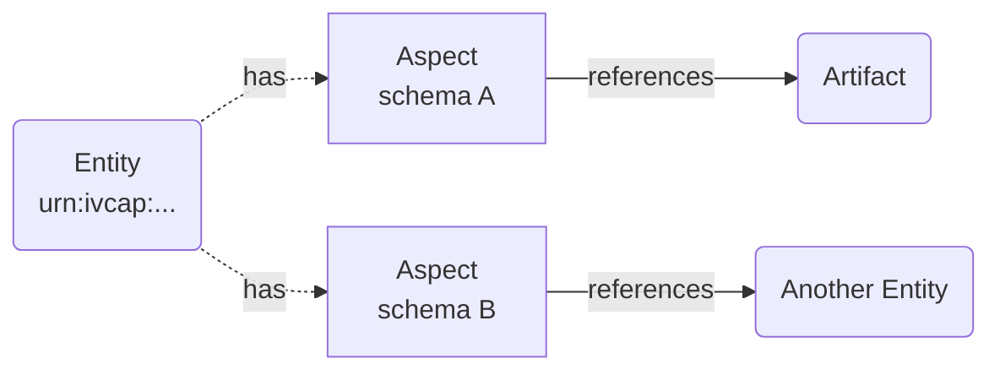

# The Data Fabric

The **Data Fabric** is IVCAP's universal, append-only information store. It is the layer
that unifies all platform data — services, jobs, artifacts, and user-defined metadata —
into a single, queryable, provenance-aware graph.

Every entity on the platform (a service registration, a job execution, an artifact upload,
a domain classification) is described by one or more **[Aspects](aspects-and-provenance.md)**
attached to its URN. The Data Fabric is the store for all of those aspects.

---

## Core concepts



| Concept | Description |
|---|---|
| **Entity** | Any addressable thing in IVCAP — a service, job, artifact, or even a domain concept like a camera or field trip. Entities are typeless; they are described entirely by their aspects. |
| **Schema** | A URN-addressed JSON Schema document that defines the shape of an aspect's content. Schemas are themselves entities in the Data Fabric. |
| **Aspect** | A typed, time-stamped, append-only metadata record attached to an entity. The fundamental unit of information in the Data Fabric. See [Aspects and Provenance](aspects-and-provenance.md). |
| **Principal** | An authenticated user or service agent that asserts aspects. |
| **Policy** | Rules governing who can read, add, or retract aspects on specific entities. |

---

## What lives in the Data Fabric

The Data Fabric is intentionally generic — it stores *all* platform information, not just
domain metadata. This means you can query across categories that would normally be siloed:

- **Platform provenance** — job lifecycle events, artifact lineage, service versions
- **Domain annotations** — classifications, measurements, survey metadata
- **Collections** — groupings of related entities (field trips, camera deployments, datasets)
- **Model outputs** — inference results attached to the artifact or observation they describe
- **Agent reasoning** — intermediate steps, decisions, and chain-of-thought from AI services

---

## Append-only and time-travel

The Data Fabric never deletes information. Every change is expressed as a new aspect with
a `validFrom` timestamp, while the old aspect is retracted by setting `validTo`.

This means you can **query the state of any entity at any point in the past**:

```bash
# What was known about this artifact on 1 June 2025?
GET /1/aspects?entity=urn:ivcap:artifact:<uuid>&at-time=2025-06-01T00:00:00Z
```

This time-travel capability makes results reproducible: given the same artifact URN and
timestamp, you will always reconstruct the same view of the world that the original
analysis saw.

---

## Collections

Collections group related entities together — for example, all images taken during a
field trip, or all artifacts produced by a processing campaign.

A collection is itself an entity with a URN. Membership is expressed as aspects:

```json
{
  "entity": "urn:ivcap:artifact:<uuid>",
  "schema": "urn:ivcap:schema:collection-member.1",
  "content": {
    "collection": "urn:ivcap:collection:<uuid>",
    "role":       "raw-image"
  }
}
```

This means an artifact can belong to multiple collections without any copying, and the
membership history is preserved with full provenance.

---

## Dataset as query

Rather than defining a dataset as a static list of files, IVCAP encourages defining
datasets by **intent** — a query over the Data Fabric that can be re-evaluated as new
data arrives.

Example intent:

> "A random sample of at most 500 images taken by camera C, acquired in region R between
> dates D1 and D2, with cloud cover below 5%."

Because this query is expressed over aspects (which record sensor, location, date, and
quality attributes), it:

- Is **repeatable** — given the same `at-time` parameter it always returns the same results
- **Grows automatically** — as new matching images arrive, the dataset expands
- **Supports auditability** — the query definition is itself an aspect on the dataset entity

---

## Searching the Data Fabric

The primary search interface is the `/1/aspects` endpoint, which supports filtering by
entity, schema, content, and time:

```bash
# All aspects on a specific artifact
GET /1/aspects?entity=urn:ivcap:artifact:<uuid>

# All aspects of a specific type across all entities
GET /1/aspects?schema=urn:ivcap:schema:remote-sensing:scene.1

# Combined content filter
GET /1/aspects?schema=urn:ivcap:schema:remote-sensing:scene.1&filter=cloud-cover-pct<5

# Historical state
GET /1/aspects?entity=urn:ivcap:artifact:<uuid>&at-time=2025-06-01T00:00:00Z
```

=== "CLI"

    ```bash
    ivcap aspect list --entity urn:ivcap:artifact:<uuid>
    ivcap aspect list --schema urn:ivcap:schema:remote-sensing:scene.1
    ```

---

## The information graph

Aspects can contain references to other entity URNs in their `content` field. This creates
an **information graph** — a web of relationships between entities that can be traversed
to answer questions like:

- Which services produced the artifacts in this collection?
- What observations reference the same specimen?
- Which jobs used a particular model version?

The graph is open-schema: any domain can define its own schemas and reference patterns
without requiring platform-level changes.

---

## Relationship to the REST API

All Data Fabric operations go through the `/1/aspects` endpoint. There is no separate
"Data Fabric API" — the aspect API *is* the Data Fabric API:

| Method | Path | Description |
|---|---|---|
| `GET` | `/1/aspects` | Search aspects with filters |
| `GET` | `/1/aspects/{id}` | Get a specific aspect |
| `POST` | `/1/aspects` | Assert a new aspect |
| `PUT` | `/1/aspects/{id}` | Retract and replace |
| `DELETE` | `/1/aspects/{id}` | Retract (set `validTo = now`) |

---

## Related concepts

- [Aspects and Provenance](aspects-and-provenance.md) — the detail of the aspect data model
- [Artifacts](artifacts.md) — data blobs stored as entities in the Data Fabric
- [Services and Jobs](services-and-jobs.md) — platform entities described by the Data Fabric
