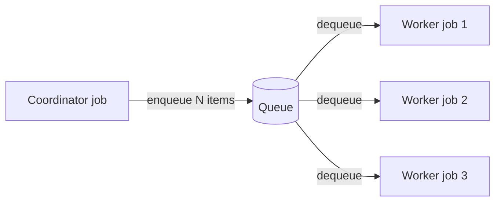

# Queues

**Queues** provide asynchronous message passing between services and pipeline stages in
IVCAP. Rather than one service directly calling another and waiting for a response, a
producer enqueues work items that one or more consumers dequeue and process independently.

```
urn:ivcap:queue:<uuid>
```

---

## When to use queues

Use queues when:

- **Processing is bursty** — a trigger event (e.g. a new artifact upload) generates many
  work items faster than they can be processed synchronously
- **You want fan-out** — a single coordinator should distribute work to multiple parallel
  worker services
- **Work items arrive continuously** — a stream of images, sensor readings, or events
  needs pipeline-style processing over time
- **Decoupling is important** — the producer should not need to know whether a consumer
  is currently running

Use direct job submission (`POST /1/services/{id}/jobs`) instead when:

- You need the result immediately and the job is short-lived
- There is a simple one-to-one relationship between request and response
- You are building an interactive workflow where the caller polls for completion

---

## Queue operations

### Create a queue

=== "REST"

    ```json
    POST /1/queues

    {
      "name":   "image-processing-pipeline",
      "policy": "urn:ivcap:policy:private"
    }
    ```

### Enqueue a message

=== "REST"

    ```json
    POST /1/queues/urn:ivcap:queue:<uuid>/messages

    {
      "content": {
        "artifact": "urn:ivcap:artifact:<uuid>",
        "priority": "high"
      }
    }
    ```

### Dequeue messages

A dequeued message is *borrowed* — it remains in the queue but is hidden from other
consumers. If the borrower does not acknowledge within a visibility timeout, the message
becomes visible again and can be re-delivered.

=== "REST"

    ```bash
    GET /1/queues/urn:ivcap:queue:<uuid>/messages?limit=10
    ```

    Each message includes a `receipt-handle` token used to acknowledge processing:

    ```json
    {
      "messages": [
        {
          "id":             "urn:ivcap:queue-message:<uuid>",
          "receipt-handle": "abc123...",
          "content": {
            "artifact": "urn:ivcap:artifact:<uuid>",
            "priority": "high"
          }
        }
      ]
    }
    ```

---

## API reference

| Method | Path | Description |
|---|---|---|
| `GET` | `/1/queues` | List queues |
| `POST` | `/1/queues` | Create a queue |
| `GET` | `/1/queues/{id}` | Get queue details |
| `POST` | `/1/queues/{id}/messages` | Enqueue a message |
| `GET` | `/1/queues/{id}/messages` | Dequeue message(s) |
| `DELETE` | `/1/queues/{id}` | Delete a queue |

---

## Pipeline patterns with queues

### Fan-out: one producer, many consumers



A coordinator service discovers N artifacts matching a query, enqueues them all, then
exits. A pool of worker services dequeue items, process them, and write results as
artifacts.

### Standing orders: trigger on new data

A **standing order** creates a persistent, live queue that is automatically populated
whenever a new artifact matching a filter expression arrives on the platform.

Worker services run continuously, dequeuing and processing new items as they arrive.
When the queue is empty for a configured idle period, the workers exit and restart
automatically when new work arrives.

This pattern supports:

- **Image ingestion pipelines** — process each frame as it uploads
- **Closed-loop experiments** — react to new sensor readings automatically
- **Streaming analytics** — continuously apply a model to a live data stream

### Example: image processing with a queue

```python
# Producer: enqueue all images in a collection
from ivcap_sdk import get_service_client, get_artifact_list

client = get_service_client()

for artifact in get_artifact_list(schema="urn:ivcap:schema:image.1"):
    client.enqueue(
        queue_id="urn:ivcap:queue:<uuid>",
        content={"artifact": artifact.id, "model": "v2.1"}
    )
```

```python
# Consumer: dequeue and process
from ivcap_sdk import get_service_client, save_artifact

client = get_service_client()

while True:
    messages = client.dequeue("urn:ivcap:queue:<uuid>", limit=1)
    if not messages:
        break

    msg = messages[0]
    result = run_model(msg.content["artifact"], msg.content["model"])
    save_artifact(result, mime_type="application/json", name="inference-result.json")
    client.ack(msg.receipt_handle)
```

---

## Queues and provenance

Because each dequeue-and-process step is a regular IVCAP job, all the standard provenance
aspects are recorded automatically. The result artifact is linked back to the input
artifact and the service version that processed it — even in a high-throughput pipeline
processing thousands of items.

---

## Related concepts

- [Services and Jobs](services-and-jobs.md) — the primary unit of work that queues feed
- [Agentic Patterns](agentic-patterns.md) — orchestrators that use queues for fan-out
- [Aspects and Provenance](aspects-and-provenance.md) — how pipeline steps are recorded
