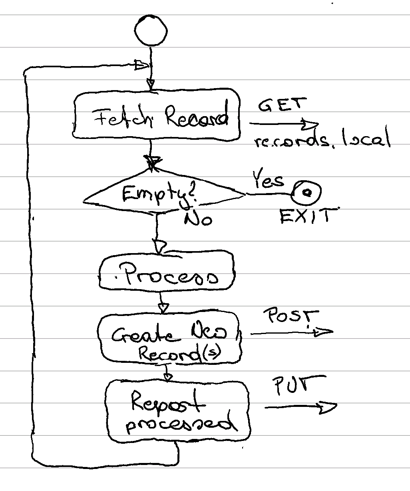

# ADR 1: Supporting Standing Orders

In the context of __(use case)__
facing __(concern)__
we decided for __(option)__
to achieve __(quality)__
accepting __(downside)__.

## Status

* Status: proposed
* Author(s): Max Ott
* Decider(s):
* Date: 2022-06-06

## Context

IVCAP is currently implementing a order-produce-deliver model where the user places an order for the execution of a specific analytics service. Internally, each order triggers the execution of a workflow. When the workflow ends, the order concludes, either successfully or with an error. However, we now want to support a new use case, where a specific workflow should be automatically triggered when a new artifact with certain attributes is uploaded to IVCAP.

IVCAP is also a _provenance-first_ system which means that we want to as completely as possible track the lineage of each artifact or record in the system. For instance, in the current "simple" model, for every artifact created by a workflow in response to an order, we will have recorded the order, the issuer of the order, the version of the workflow and all included analytics steps, as well as any additional artifacts involved in the various calculations. It should therefore, be possible to "reverse-reason" the lineage graph. Meaning, we should be able to consider a "standing order" as a _predictor_ for a new set of artifacts and their lineage whenever a new artifact with certain attributes is added to IVCAP.

## Decision Drivers

* Want to support use cases with _pipeline_ style processing, such as ingestion of image sequences.
* Want to support _data-driven_ use cases, such as closed-loop experiments

## Decision

_What is the change that we're proposing and/or doing?_

## Consequences

_What becomes easier or more difficult to do because of this change?_

## Detailed Discussion

Conceptually, a _standing order_ creates a _queue_ containing all current and future records which pass a certain filter operation on all of it's associated attributes. One or more identical workflows are started to process the events in the queue. When the queue is empty for some times, the workflows exit, to be started up again when new records are being added to the queue.

### Extend Order Schema

The current order schema references the service (workflow) to execute and its respective parameters. Parameters can contain references to local artifacts in the form of a url which is resolved by the _data proxy_ sidecar to IVCAP's artifact store.

We will extend the order schema with an _execution_ type to differentiate between the current "one-shot" execution and the proposed "standing" one. We also need to add a `selector` parameter which conceptually is a query over all current records in the system plus any new records added going forward.

To get started, we'll restrict that to a `queue-id:UUID` where the ID is a randomly generated UUID (v1/4) by the requester and expect that all corresponding artifacts include the same as metadata. This is obviously neither secure nor flexible enough for production, but a simple enough starting point.

### Workflow Execution

In the initial version, a "standing" order will have a "queue" parameter (a URL) automatically added. The workflow will need to include a task which repeatedly queries the queue (GET) for a list of records to process. Each record will contain a `ReceiptHandle` (borrowed from [^1]) which is used to report the handling of said message together with a status - `DoneOK`, `DoneError`, `Requeue`. Internally, a record is considered "borrowed" after it's been passed to a workflow task. If no status report is received for a specific duration, it is assumed that processing failed and the record is re-enqueued. The workflow should exit when no more records are being returned by the record queue.

### Standing Order Manager (SOM)

While we could extend the current `order_dispatcher` to also manage standing orders, it will be cleaner to create a new service which in turn is using the current `order_dispatcher` to start and re-start workflows to process the record queue the same manner we now operate on `one-shot` orders.

A SOM will have the following tasks to perform:

* Create, maintain, and dispose a (virtual) queue of records to be processed by each standing order
* Maintain an active workflow whenever there are records to be processed.

Currently, all artifacts are stored in a relational database (except for blobs which are only referenced) and to avoid adding any additional services we will realise the record queue as a database table. The SOM will periodically, or whenever a new artifact record is being added, check for any additional artifacts fulfilling the standing orders' filters, and when found will add a respective record to the `queue` table.

It will also maintain an additional table to keep track of the workflows operating on behalf of a standing order. If a new artifact is being added to a queue and no workflow is currently operating on that queue, the SOM will request the `order_dispatcher` to start a new workflow.

### Data Proxy

The data proxy needs to be extended with a Caddy module to process queue requests from the workflow tasks. Similarly to the `storage.local` we will introduce a `queue.local` endpoint. We will also extend the `metadata` interface to support querying for queue content and manage the state of individual queue elements (_pending_, _borrowed_, _processed_).

### Order Dispatcher

While the SOM takes care of most of the management of standing orders, there is one minor change we have to make to the _order dispatcher_. Currently, each order is associated with a maximum of __1__ workflow run. However, a long running standing order with bursty creation of new artifacts may result in multiple execution of a workflow in service of a single order. We will therefore split out the workflow details from the order schema and create a new `workflow_run` schema with a one-to-many relation between the former and latter.

[^1]: [AWS SQS Receive Message](<https://docs.aws.amazon.com/AWSSimpleQueueService/latest/APIReference/API_ReceiveMessage.html>)

---
_This template is a light variation of the one introduced in [Documenting architecture decisions - Michael Nygard](http://thinkrelevance.com/blog/2011/11/15/documenting-architecture-decisions)._
