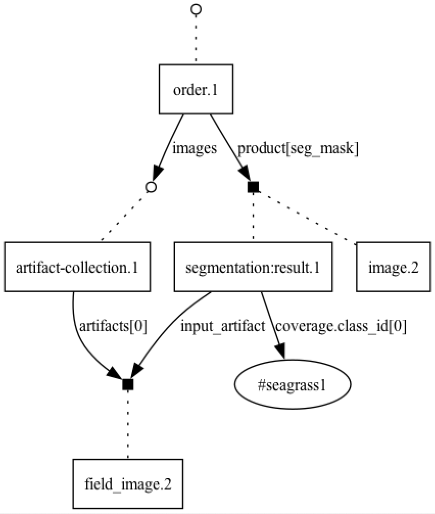

# Providing a Datafabric Service

In the context of __(use case)__
facing __(concern)__
we decided for __(option)__
to achieve __(quality)__
accepting __(downside)__.

## Status

* Status: proposed (_any of proposed, accepted, rejected, deprecated, superseded_)
* Author(s): Max Ott
* Deciders: ???
* Date: 2023-12-06

Technical Story: (if appropriate)

## Context

One of IVCAP's basic tenants is _Provenance First_ and we have implemented a `metadata` service for that.
However, we always talked about being able to merge _classical_ metadata with data produced by the services
themselves. John also raised valid concerns about the murky lines between information about the core entities,
such as `service`, `order`, and `artifacts`; and the more broader, user provided metadata.

In addition, I have been struggling to clearly articulate the information model underlying the current `metadata` service.
Therefore, the goal for this ADR is to further clarify that, and properly document it.

It should be noted, that the above mentioned core information will still need to be reflected in a datafabric as well,
how to do this, needs to be part of this ADR.

## Decision Drivers

* Delivering more fully on _Provenance First_
* Bridging the semantic gap between _classical_ metadata and _classical_ data itself
* Clearer communication on the _aspect data/information model_
* More powerful - and hopefully simpler - mechanisms to query the resulting _information graph_

## Decision

_What is the change that we're proposing and/or doing?_

## Consequences

* Pro: Implementing a Datafabric as defined by this ADR will bring us closer to the overall vision for IVCAP
* Pro: Cleanly separating core IVCAP information should simplify debugging of those core services
* Con: This will create substantial downstream work, such as updating `ivcap-cli`, and the various SDKs
* Con: Core IVCAP information will still need to be accessible in the datafabric, resulting in either data duplication
or additional implementation complexity

## Considered Options

None explicitely

## Detailed Discussion

The currently implemented metadata model consists of the following concepts:

* Entity: Named (URN), but typeless pointer to some _thing_
* Schema: Formal description of a type of information to attach to an entity
* Aspect: An information _bundle_ defined by a specific _schema_ attached to an _entity_
* Principal: An entity representing an agent managing the life-cycle of an aspect
* Policy: An entity defining what a principal can do in regards to aspects
* ValidFromTo: A time range during which an aspect has been asserted by a principal to be true

Informally, an entity is described by one or many aspects. It is valid for an entity to have multiple aspects with
the same schema, and potentially even conflicting information held in them. However, it is expected that they are _asserted_
by different principals, or for non-overlapping valid time intervals. The latter refers to the _no update_ rule. If an aspect
is considered no longer valid we set the `validTo` to `now` (in fact, this is the only _update_ operation allowed). If an
aspect has been identified at some time `t` as being false, it's `validTo` date can be set to `t` and a new aspect with the
(hopefully now) correct information will be issued with a `validFrom` set to `t`. However, that does assume that the _principal_
wanting to set the `validTo` date is authorized to do so by the associated _policy_.

__Open question:__ Do we need to constrain `validFrom` and `validTo` be only set to `now`. What implications does a more relaxed environment will have? For instance, if we have learned that an aspect ceased to be true at time `now - 2`, we do not necessarily know if some decision `D` taken at `now - 1` considered this now incorrect information. Setting the `validTo` to `now -2` may not allow us to justify `D` in the future. Ultimately we'll need to find a solution to "correct the past", but this may require a different approach.

While this information model may seem overly complicated it is a driven by the following requirements:

* Provenance requires us to _remember_ what was known at some time `t` in the past. Therefore we have to keep history (`ValidFromTo`)
* The world is messy, and different _observers_ may have different observations of the same phenomena potentially leading
to conflicting information. Keeping track of the reporting principal may allow us to decide what aspects to consider and
aspects to ignore, or anything in between
* `Typeless` entities allow different 'communities' to describe an entity using different 'languages'.

However, we have currently ignored certain aspects of _assertion_ based systems,
such as `speaksFor` which will be required if we want to capture use cases, such as agents performing activities on behalf of
someone, or if we want to distinguish between _group principals_ and the actual principal acting on behalf of that group.

The following diagram may illuminate some of the core concepts. The small dots or quadrats represent entities. The rectangles, linked to the entity with a dotted line, represent aspects of a certain schema (text inside the rectangle). The solid black lines identify references declared inside an aspect (property) to an another entity.



### Data Model

One way to model the above is defining an aspect tuple:

```
(
  id: URN,
  entity: URN, schema: URN,
  content: any, contentType: MIMEType,
  asserter: URN, policy: URN, validFrom: Date,
  revoker?: URN, validTo?: Date
)
```

The `id` is unique reference to a specific tuple. `entity` identifies the entity this aspect is attached to, while
`schema` identifies the schema. The `content` holds the actual information content of the aspect, with `contentType`
identifying the 'encoding' used (e.g. `application/json`). `asserter` refers to the principal publishing this aspect, or more specifically declaring it to be true as of `validFrom`. `policy` refers to the policy govern on who can see this aspect
and who can potentially revoke it at a later date. Finally, we have the only two fields which are initially unspecified,
but may be set, but only once and at the same time, at a later date. The unspecified `validTo` is assumed to
represent `infinity`. When `validTo` is set, `revoker` is set to the principal requesting it.

While we so far insisted that entities are type less and by itself without information content, we do assume additional
'constraints' on the above URNs as follows:

* __schema:__ The URN is either a URL referencing an external schema description (initially limited to
[JSON Schema](https://json-schema.org/)). If it is a "systems" URN, we assume that it contains an aspect
containing the schema description (initially limited to a small number of "schema schemas", such as
[https://json-schema.org/draft/2020-12/schema](https://json-schema.org/draft/2020-12/schema))
* __asserter, revoker:__ The entity referred by this URN is supposed to have an aspect further describing this
principal. _The supported schemas need to be defined_.
* __policy:__ The entity referred by this URN is supposed to have an aspect further describing policy used for
authorisation. The respective schema will be determined by the policy machinery used. _Given the security implications,
we may NOT want to store the policies themselves in the same data fabric. It may in fact lead to either interesting, or
impossible meta problems._

### Service API

At a basic level, we should be able to adopt the current `metadata` API with a small semantic shift from metadata "record" to data fabric "aspect"

* list: `GET /1/aspects?entity=_urn_&schema=_urn_&at-time=_date_...`
* get: `GET /1/aspects/:id`
* add: `POST /1/aspects`
* revoke: `DELETE /1/aspects/:id`
* revoke & add: `PUT /1/aspects/:id`

with potentially some convenience methods:

* revoke & add: `PUT /1/aspects?entity=_urn_&schema=_urn_` (Assumes there is only aspect with `schema` attached to `entity`)

#### Schemas

We most likely want to treat schemas differently. The above API would allow for managing schemas, after all they can be models as aspects with specific schemas, but that would require that a user will know those various meta schemas used. So the following is essentially a convenience wrapper over the above API.

One open question relates to "correcting" a schema. Schemas are supposed to be versioned, so classical "updating" does not and should not be supported. However, mistakes happen in the real world and the wrong description of a particular schema may gets uploaded initially. Can that be simply handled by the above `revoke & set`? What happens to the aspects referring to the incorrect version of the schema during the time it was valid? Also, the base model would allow multiple principals to upload potentially different descriptions (aspects) of the same schema (here an entity)? This should fundamentally be allowed, however it most likely would require an extension to the base model as it would now allow for specifying which of the potentially multiple descriptions(aspect) to use as "actual" schema. A potential, initial solution would be to limit schemas to a single description and break our "no update" rule by always only considering the latest description as the "validating schema" across the entire history.

* list: `GET /1/schemas?query=_string_&at-time=_date_...` (the number of schemas should be small)
* get: `GET /1/schemas/:id`
* add: `POST /1/schemas`
* add: `PUT /1/schemas/:id` (this is an 'updated' - see above paragraph)

#### Search

What has been missing from the current metadata API is a __graph search__ capability. As one can see from the diagram above, an aspect can contain a reference to another entity, essentially creating an information graph. However, given the aspect-centered, open schema information model as well as user definable policies may not easily be mappable onto classical graph databases. In fact, our requirement to be able to include data produced by IVCAP services (as artifact) means that not all the information we want to search over is actually in the database.

Fortunately, we currently don't have too much data as well as too many users, so we can experiment with various options with the primary focus on usability and less on performance.
