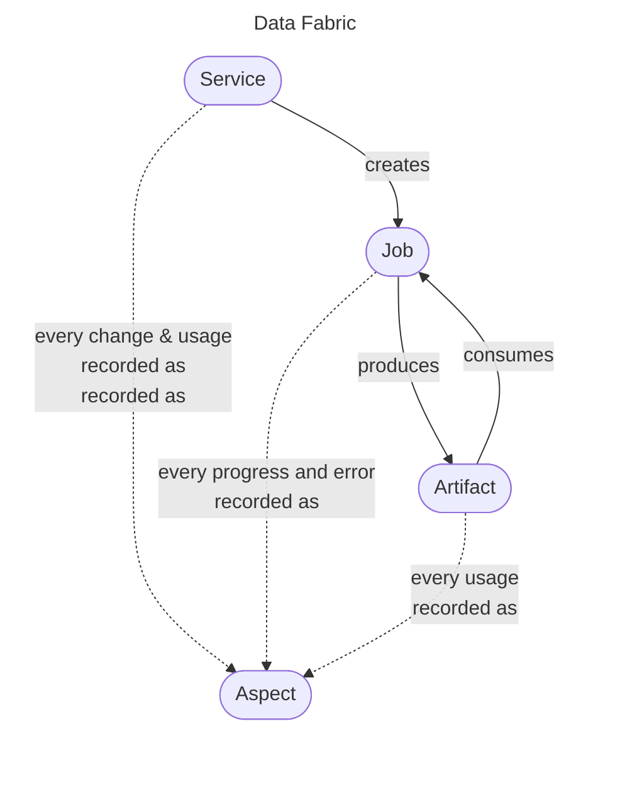

# How IVCAP Works

IVCAP is a **managed execution platform** built around four core ideas:

1. **Everything is a service.** Any analysis, model, or workflow can be registered
   as a containerised service with typed inputs and outputs.
2. **Every execution is recorded.** Jobs, artifacts, and metadata are all
   append-only records — giving you a complete, immutable audit trail.
3. **Agents are first-class citizens.** Services can autonomously call other
   services, call LLMs, and orchestrate complex workflows — without any
   pre-authorisation.
4. **Data and metadata are unified.** Artifacts (data blobs) and Aspects (typed
   metadata) live together in the Data Fabric, making every result queryable,
   composable, and reproducible.

---

## The core entities

| Entity | What it is | URN pattern |
|---|---|---|
| **Service** | A registered analytic capability | `urn:ivcap:service:<uuid>` |
| **Job** | A single execution of a service | `urn:ivcap:job:<uuid>` |
| **Artifact** | Any data blob (image, CSV, model, JSON, …) | `urn:ivcap:artifact:<uuid>` |
| **Aspect** | A typed, append-only metadata record on any entity | `urn:ivcap:aspect:<uuid>` |

---

## Concept pages

- **[Services and Jobs](services-and-jobs.md)**

    How services are defined, the execution models (basic / Argo / app-server),
    job lifecycle states, and how to submit and monitor jobs.

- **[The Data Fabric](data-fabric.md)**

    The universal information store underpinning IVCAP — collections,
    annotations, datasets, and cross-entity search.

- **[Aspects and Provenance](aspects-and-provenance.md)**

    How typed, append-only metadata works, how the platform auto-records
    provenance for every event, and how to query history at any point in time.

- **[Artifacts](artifacts.md)**

    How data is stored, uploaded (single-shot or resumable TUS), downloaded,
    and shared between services — with automatic provenance via aspects.

- **[Queues](queues.md)**

    Async message passing between services — when to use queues instead of
    direct service calls, and how to design fan-out pipelines.

- **[Agentic Patterns](agentic-patterns.md)**

    Services calling other services autonomously, LLM integration via the
    sidecar, and building multi-agent workflows.

