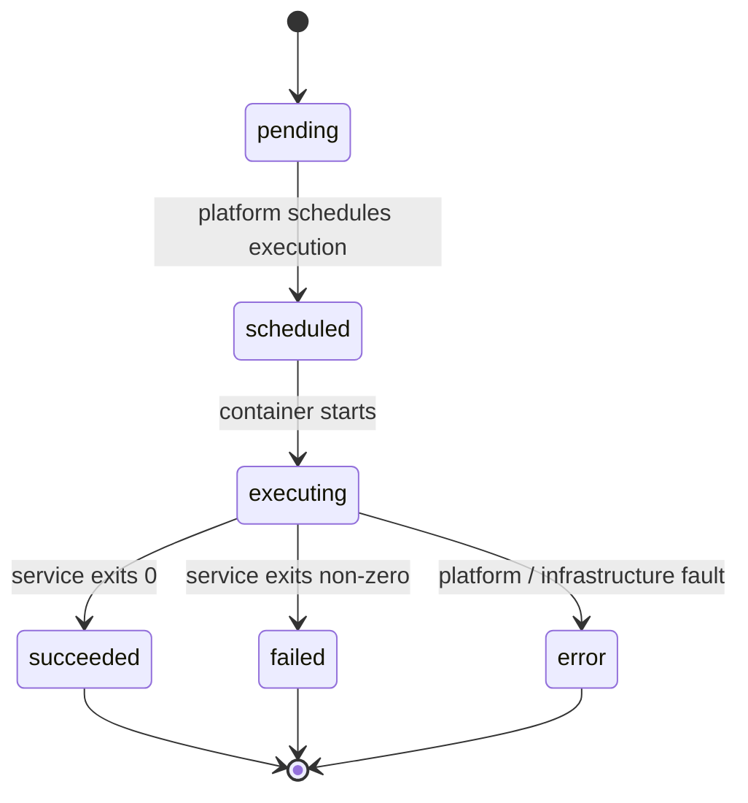

# Services and Jobs

In IVCAP, a **Service** is a registered analytic capability and a **Job** is a single
execution of that service. Together they form the primary unit of work on the platform.

---

## Services

A service describes *what* can be run: its name, parameters, execution environment, and
access policy. Services are registered by providers and are immutable once published —
updates result in a new version of the service definition.

### Service definition

```json
{
  "id": "urn:ivcap:service:3c51bd86-fd86-53bc-a932-91ff3a1e2fee",
  "name": "AI tool to check for prime numbers",
  "description": "Checks if a number is prime.",
  "controller-schema": "urn:ivcap:schema.service.rest.1",
  "controller": {
    "$schema": "urn:ivcap:schema.service.rest.1",
    "command": [
      "python",
      "/app/tool-service.py"
    ],
    "image": "45a06508-5c3a-4678-8e6d-e6399bf27538/ivcap_python_ai_tool_template_amd64:06548bc",
    "resources": {
      "limits": {
        "cpu": "500m",
        "memory": "1Gi"
      },
      "requests": {
        "cpu": "500m",
        "memory": "1Gi"
      }
    }
  },
  "policy": "urn:ivcap:policy:ivcap.open.metadata",
  "status": "active"
}
```

### Parameter types

| Type | Description |
|---|---|
| `string` | Plain text |
| `int` | Integer number |
| `float` | Floating-point number (optional `unit`) |
| `bool` | Boolean flag |
| `artifact` | Reference to an IVCAP artifact URN |

### Execution models

IVCAP supports pluggable execution models via the `workflow.type` field:

| Type | Description |
|---|---|
| `basic` | Single container, executed via the Argo workflow engine. The most common model. |
| `argo` | Full Argo workflow YAML, for multi-step pipelines with explicit DAG control. |
| `app-server` | Hosts a static web application served from an artifact (e.g. a React app). |

### Listing and inspecting services

=== "CLI"

    ```bash
    # List all accessible services
    ivcap service list

    # Inspect a specific service
    ivcap service get urn:ivcap:service:<uuid>
    ```

=== "REST"

    ```bash
    GET /1/services
    GET /1/services/urn:ivcap:service:<uuid>
    ```

---

## Jobs

A **job** is created by submitting a request to a service with a set of parameters. Each
job gets its own URN and is independently tracked through its lifecycle.

> **Note on terminology:** Older parts of the API and CLI use the word *order* instead of
> *job*. They mean the same thing. The platform is converging on *job* as the canonical term.

### Submitting a job

=== "CLI"

    ```bash
    ivcap service create urn:ivcap:service:<uuid> -f request.json
    ```

=== "REST"

    ```json
    POST /1/services/urn:ivcap:service:<uuid>/jobs

    {
      "name": "my-fire-analysis-run-1",
      "parameters": [
        { "name": "region",     "value": "Tasmania-North" },
        { "name": "threshold",  "value": "0.05" },
        { "name": "input-data", "value": "urn:ivcap:artifact:<uuid>" }
      ]
    }
    ```

The platform returns immediately with the job URN and initial status:

```json
{
  "id":     "urn:ivcap:job:<uuid>",
  "status": "pending",
  "links":  { "self": "/1/services/.../jobs/urn:ivcap:job:<uuid>" }
}
```

### Job lifecycle



| Status | Meaning |
|---|---|
| `pending` | Job record created; awaiting scheduling |
| `scheduled` | Execution environment is starting |
| `executing` | Service container is actively running |
| `succeeded` | Service completed successfully |
| `failed` | Service reported a failure (non-zero exit) |
| `error` | Platform error — infrastructure fault, timeout, or resource exhaustion |

### Polling and streaming

=== "CLI (poll)"

    ```bash
    ivcap order get urn:ivcap:job:<uuid>
    ```

=== "REST (poll)"

    ```bash
    GET /1/services/<svcId>/jobs/<jobId>
    ```

=== "REST (live stream)"

    ```bash
    # Server-Sent Events — stream closes when job reaches a terminal state
    curl -N -H "Authorization: Bearer <token>" \
      https://api.example.ivcap.net/1/services/<svcId>/jobs/<jobId>/events
    ```

Events are emitted as [CloudEvents](https://cloudevents.io/) JSON:

```
event: ivcap.job.status
data: {"id":"urn:ivcap:job:<uuid>","status":"executing","timestamp":"..."}

event: ivcap.job.status
data: {"id":"urn:ivcap:job:<uuid>","status":"succeeded","timestamp":"..."}
```

### Retrieving results

Once a job has `succeeded`, retrieve its output artifacts:

=== "CLI"

    ```bash
    # List what the job produced
    ivcap job get urn:ivcap:job:<uuid>

    # Download a specific result artifact
    ivcap artifact download urn:ivcap:artifact:<uuid> -f result.png
    ```

=== "REST"

    ```bash
    GET /1/services/<svcId>/jobs/<jobId>/output
    GET /1/artifacts/<artifactId>/blob
    ```

---

## Worked example

```bash
# 1 – Find a service
$ ivcap service list
+----+---------------------+
| @1 | Gradient Text Image |
+----+---------------------+

# 2 – Upload an input
$ ivcap artifact upload background.png --name "background" --mime-type image/png
ID: urn:ivcap:artifact:6a1c3f2e-...

# 3 – Submit the job
$ echo '{"msg": "Hello IVCAP", "img-art": "urn:ivcap:artifact:6a1c3f2e-..."}' | ivcap service create @1 -f -
Job 'urn:ivcap:job:505c8573-...' with status 'pending' submitted.

# 4 – Wait for completion
$ ivcap job get urn:ivcap:job:505c8573-...
  Status  succeeded
Products  @1 │ out.png │ image/png

# 5 – Download the result
$ ivcap artifact download urn:ivcap:artifact:6f390b51-... -f /tmp/out.png
```

---

## Related concepts

- [Artifacts](artifacts.md) — how input and output data is stored and referenced
- [Aspects and Provenance](aspects-and-provenance.md) — how every job event is automatically recorded
- [Queues](queues.md) — for pipeline patterns where jobs produce work for downstream consumers
- [Agentic Patterns](agentic-patterns.md) — services that autonomously submit sub-jobs
