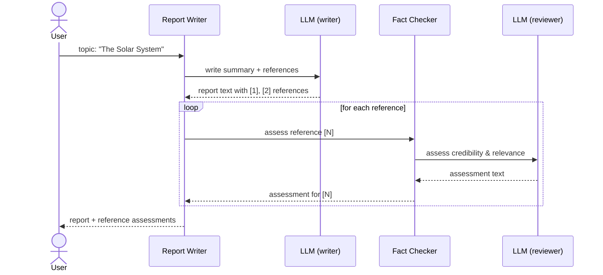

# Build Your First AI Agent Service

This tutorial gives you a high-level picture of how to build AI agents on IVCAP —
services that call an LLM and, crucially, call **other IVCAP services** as part of
their reasoning.

We use the **Agent Calling Agent** tutorial as the worked example. It builds two
cooperating services:

- **Fact Checker** — receives a list of references and asks an LLM to assess the
  credibility and relevance of each one.
- **Report Writer** — receives a topic, asks an LLM to write a concise summary, then
  passes the generated references to the Fact Checker for validation.

The result is a structured report with per-reference assessments attached.

The full, step-by-step tutorial (including all source code) lives here:

**[github.com/ivcap-works/agent-calling-agent-tutorial](https://github.com/ivcap-works/agent-calling-agent-tutorial)**

!!! note "Prerequisite"
    This tutorial assumes familiarity with the basic IVCAP service development
    workflow. If you haven't done so yet, start with
    [Build Your First Service](build-service.md).

---

## How the two agents cooperate



Both services are ordinary IVCAP services — deployed independently, discoverable
via `ivcap service list`, and invokable directly with `ivcap job create`.
The Report Writer discovers and calls the Fact Checker at runtime using the
**IVCAP agent client** built into the service SDK.

---

## Prerequisites

| Tool | Purpose |
|------|---------|
| Python 3.9+ | Service implementation |
| [Poetry](https://python-poetry.org/) + `poetry-plugin-ivcap` | Dependency management and IVCAP tooling |
| Docker | Build and test service containers |
| `ivcap` CLI (installed & authenticated) | Deploy services and run jobs |
| Git | Version the code |
| Access to an LLM API key | Both services call an LLM (OpenAI-compatible) |

---

## The key ideas

### 1 — Each agent is a normal IVCAP service

There is no special "agent" runtime. Each agent is a Python function wrapped with
`ivcap-ai-tool`, containerised, and deployed exactly as in the
[Build Your First Service](build-service.md) tutorial. The `@service` decorator
handles HTTP, schema validation, and platform registration.

### 2 — The Fact Checker: a stateless LLM wrapper

The simpler of the two services. For each reference it receives, it constructs
LLM prompts and returns an assessment:

```python
# system: "You are a critical academic reviewer."
# user:   "Assess the credibility and relevance of this reference: {ref}"
```

It has no knowledge of the Report Writer — it can be called by any service or
directly by a user.

### 3 — The Report Writer: an agent that calls another agent

After writing the report, the Report Writer extracts references from the LLM
output and calls the Fact Checker via IVCAP's agent client, which is injected
into the service through `JobContext`:

```python
def check_references(report_text: str, request: ReportRequest, ctxt: JobContext):
    # Find lines starting with '[' — these are the references
    references = [
        line.strip()
        for line in report_text.splitlines()
        if line.strip().startswith("[")
    ]

    # Resolve the Fact Checker service by its URN
    agent = ctxt.ivcap.get_agent(request.fact_checker.agent_id)

    # Build a typed request and call the agent synchronously
    req = agent.request_model(references=references, ...)
    job = agent.exec_agent(req)

    return job.result["results"]
```

`ctxt.ivcap.get_agent(...)` fetches the service definition and exposes a typed
client. `agent.exec_agent(req)` submits a job and waits for the result — the
platform handles scheduling, retries, and provenance recording automatically.

### 4 — Deploy in dependency order

Because the Report Writer needs the Fact Checker's service URN at runtime, deploy
the Fact Checker first:

!!! note "Future: named service discovery"
    Passing the Fact Checker's URN explicitly at job submission time will not
    always be necessary. A planned move to **named services** will allow agents
    to discover their dependencies dynamically by name at runtime, removing the
    need to know (or hard-code) a specific service URN in advance.

```bash
# In fact_checker/
git add . && git commit -m "fact checker v1"
poetry ivcap deploy

# Note the service URN printed at the end, then:

# In report_writer/
git add . && git commit -m "report writer v1"
poetry ivcap deploy
```

### 5 — Run the pipeline

Create a request file `solar.json`:

```json
{
  "topic": "The Solar System",
  "fact_checker": {
    "agent_id": "urn:ivcap:service:<fact-checker-urn>"
  }
}
```

Then submit the job:

```bash
cd report_writer
poetry ivcap job-exec tests/solar.json
```

After a few seconds you will get a structured result with the generated report
and per-reference credibility assessments:

```yaml
topic: The Solar System
content: >-
  The Solar System consists of the Sun and all objects bound to it by gravity ...

  References:
  [1] NASA Solar System Exploration - https://solarsystem.nasa.gov/...
  [2] European Space Agency (ESA)   - https://www.esa.int/...

references:
  - reference: "[1] NASA Solar System Exploration - ..."
    assessment: "This reference is highly credible. NASA is a leading authority ..."
  - reference: "[2] European Space Agency (ESA) - ..."
    assessment: "..."
```

---

## What IVCAP gives you for free

| Concern | How IVCAP handles it |
|---------|---------------------|
| Service discovery | `ivcap service list` — both agents are immediately discoverable |
| Typed inter-service calls | `ctxt.ivcap.get_agent()` fetches and validates the service schema |
| Provenance | Every job records inputs, outputs, service version, and which sub-jobs were called |
| Scalability | Each agent runs in its own container; IVCAP schedules them independently |
| Reuse | The Fact Checker can be called by any other service or user directly |

---

## Full tutorial

For complete source code, Dockerfiles, Poetry configuration, and step-by-step
explanations, follow the full tutorial in the example repository:

[→ Full tutorial on GitHub](https://github.com/ivcap-works/agent-calling-agent-tutorial){ .md-button .md-button--primary }

---

## Next steps

- **Guides → Building AI Agents** covers agentic patterns, multi-agent
  orchestration, integrating frameworks like CrewAI, and using IVCAP from
  external AI assistants and Jupyter Notebooks via MCP.
- **Concepts → Agentic Patterns** explains the design principles behind
  IVCAP's approach to agents.
