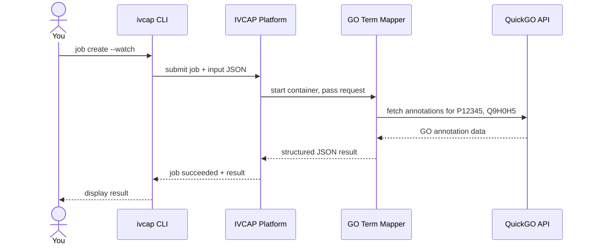

# Run Your First Analysis

This tutorial walks you through submitting a job to an existing IVCAP service and
inspecting the results — entirely from the CLI, no code required.

We will use the **Gene Ontology (GO) Term Mapper** service as the example.
It takes a list of UniProt protein IDs and returns GO annotations (biological
process, molecular function, or cellular component) fetched from the
[QuickGO](https://www.ebi.ac.uk/QuickGO/) database.

**What you will do**

1. Find the service
2. Prepare the job input
3. Submit the job and wait for it to finish
4. Inspect the results

---

## Prerequisites

- `ivcap` CLI installed and authenticated — see [Install the CLI](install.md)
- Access to an IVCAP deployment that has the GO Term Mapper service registered

---

## 1 — Find the service

List available services and search for the GO Term Mapper:

```bash
ivcap service search gene-ontology
```

```
+----+----------------------------------+---------------------------------------------------+
| ID | NAME                             | DESCRIPTION                                       |
+----+----------------------------------+---------------------------------------------------+
| @1 | Gene Ontology (GO) Term Mapper   | Maps UniProt IDs to GO terms via QuickGO.         |
+----+----------------------------------+---------------------------------------------------+
```

> **`@1` is a local alias** for the full service URN. The CLI stores these aliases
> in its history so you can use `@1` in subsequent commands within the same session.
> Use `--no-history` if you prefer to see (and work with) the raw URNs directly.

Inspect the service to see its expected parameters:

```bash
ivcap service get @1
```

```
        Name  Gene Ontology (GO) Term Mapper
 Description  Maps UniProt IDs to GO terms via QuickGO.

          ID  urn:ivcap:service:ac158a1f-dfb4-5dac-bf2e-9bf15e0f2cc7 (@1)
      Status  active
```

Note the service URN — you will need it when submitting the job.

---

## 2 — Prepare the job input

Job parameters are passed as a JSON file. Create a file called `go_request.json`:

```json
{
  "$schema": "urn:sd:schema.gene-ontology-term-mapper.request.1",
  "ids": [
    "P12345",
    "Q9H0H5"
  ],
  "category": "BP"
}
```

| Field      | Description |
|------------|-------------|
| `ids`      | One or more UniProt protein IDs to look up |
| `category` | GO category to filter by: `BP` (biological process), `MF` (molecular function), or `CC` (cellular component). Omit to return all categories. |

---

## 3 — Submit the job

Use `ivcap job create` with the `--watch` flag to submit the job and wait for
it to complete before returning:

```bash
ivcap job create urn:ivcap:service:ac158a1f-dfb4-5dac-bf2e-9bf15e0f2cc7 \
    -f go_request.json \
    --watch
```

!!! tip
    Replace the service URN above with the one shown by `ivcap service get @1`,
    or simply use the alias: `ivcap job create @1 -f go_request.json --watch`

You will see the job details once it finishes:

```
        Name  go-term-mapper-xq7pf2

          ID  urn:ivcap:job:3fa85f64-5717-4562-b3fc-2c963f66afa6 (@1)
      Status  succeeded
  Started At  8 seconds ago
 Finished At  just now
     Service  urn:ivcap:service:ac158a1f-dfb4-5dac-bf2e-9bf15e0f2cc7

 Result-Type  application/vnd.ivcap.urn:sd:schema.gene-ontology-term-mapper.1
      Result  {
                "$schema": "urn:sd:schema.gene-ontology-term-mapper.1",
                "results": {
                  "P12345": [ ... ],
                  "Q9H0H5": [ ... ]
                }
              }
```

### Streaming progress events

If you want to watch live events while the job runs (useful for longer jobs),
replace `--watch` with `--stream`:

```bash
ivcap job create @1 -f go_request.json --stream
```

---

## 4 — Inspect the results

### Check job status later

If you submitted without `--watch`, you can poll the status at any time:

```bash
ivcap job get @1
```

### List your recent jobs

```bash
ivcap job list --limit 5
```

```
 At Time  just now
    Jobs  ┌────┬──────────────────────────────────┬───────────┬──────────────┐
          │ ID │ SERVICE                          │ STATUS    │ REQUESTED AT │
          ├────┼──────────────────────────────────┼───────────┼──────────────┤
          │ @1 │ Gene Ontology (GO) Term Mapper   │ succeeded │ just now     │
          └────┴──────────────────────────────────┴───────────┴──────────────┘
```

### View the full result as JSON

```bash
ivcap job get @1 -o json | jq .result
```

```json
{
  "$schema": "urn:sd:schema.gene-ontology-term-mapper.1",
  "results": {
    "P12345": [
      {
        "id": "UniProtKB:P12345!306410578",
        "geneProductId": "UniProtKB:P12345",
        "qualifier": "involved_in",
        "goId": "GO:0006103",
        "goAspect": "biological_process",
        "goEvidence": "ISS",
        "assignedBy": "UniProt",
        "symbol": "GOT2",
        "reference": "GO_REF:0000024"
      }
    ],
    "Q9H0H5": [ ... ]
  }
}
```

---

## What just happened?



IVCAP took your input, spun up the GO Term Mapper container, called the QuickGO
API on your behalf, and stored the structured JSON result. The result — along with
a full provenance record linking input parameters, service version, and output — is
permanently available under the job URN.

---

## Next steps

Ready to build a service yourself? The next tutorial walks you through creating
and deploying a service just like this one:

[→ Build Your First Service](build-service.md){ .md-button .md-button--primary }
