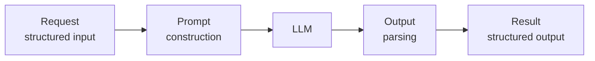
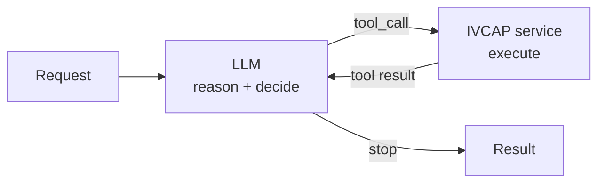
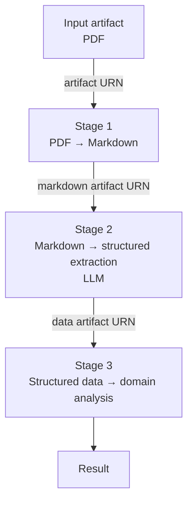
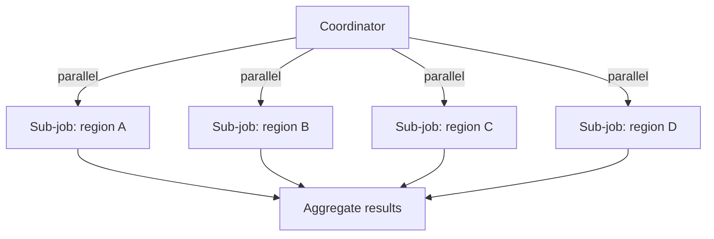

# Agent Patterns on IVCAP

This page describes the common design patterns for building AI agent services on IVCAP.
All patterns share the same foundation: a Python function wrapped with `@ivcap_ai_tool`,
deployed as a container, and called via the platform's job API.

---

## Pattern 1: LLM wrapper

The simplest agent pattern. A service receives structured input, constructs a prompt,
calls an LLM via the sidecar, and returns structured output.



```python
from ivcap_service import get_llm_client, Service, JobContext
from ivcap_ai_tool import start_tool_server, ivcap_ai_tool, ToolOptions, logging_init
from pydantic import BaseModel, Field
from typing import ClassVar

logging_init()

service = Service(name="Concept Explainer")

class Request(BaseModel):
    SCHEMA: ClassVar[str] = "urn:sd:schema.explainer.request.1"
    jschema: str = Field(SCHEMA, alias="$schema")
    concept: str = Field(description="Scientific concept to explain")
    audience: str = Field("general public", description="Target audience")

class Result(BaseModel):
    SCHEMA: ClassVar[str] = "urn:sd:schema.explainer.1"
    jschema: str = Field(SCHEMA, alias="$schema")
    explanation: str

@ivcap_ai_tool("/", opts=ToolOptions(tags=["Agent", "LLM"]))
def explain(req: Request, ctxt: JobContext) -> Result:
    """Explain a scientific concept using an LLM."""
    llm = get_llm_client()
    response = llm.chat.completions.create(
        model="gpt-4o",
        messages=[
            {"role": "system", "content": f"Explain concepts clearly for {req.audience}."},
            {"role": "user",   "content": f"Explain: {req.concept}"},
        ],
        temperature=0.3,
    )
    return Result(explanation=response.choices[0].message.content)

if __name__ == "__main__":
    start_tool_server(service)
```

**When to use:** Any task that maps cleanly to a single LLM call — summarisation,
classification, translation, extraction, explanation.

---

## Pattern 2: Tool-calling agent (ReAct loop)

A service that runs a reasoning loop: the LLM decides which IVCAP service to call next,
the service executes it, and the result feeds back to the LLM for the next step.



This is the IVCAP implementation of the [ReAct](https://arxiv.org/abs/2210.03629) pattern.
The LLM acts as the reasoning engine; IVCAP services act as the tools.

```python
import json
from ivcap_service import get_llm_client, JobContext
from ivcap_ai_tool import ivcap_ai_tool, ToolOptions

TOOLS = [
    {
        "type": "function",
        "function": {
            "name": "run_fire_risk_analysis",
            "description": "Run a fire risk analysis for a named region",
            "parameters": {
                "type": "object",
                "properties": {
                    "region": {"type": "string", "description": "Region name"},
                    "threshold": {"type": "number", "description": "Risk threshold (0–1)"},
                },
                "required": ["region"],
            },
        },
    },
    {
        "type": "function",
        "function": {
            "name": "run_flood_risk_analysis",
            "description": "Run a flood risk analysis for a named region",
            "parameters": {
                "type": "object",
                "properties": {
                    "region": {"type": "string", "description": "Region name"},
                },
                "required": ["region"],
            },
        },
    },
]


@ivcap_ai_tool("/", opts=ToolOptions(tags=["Agent", "Orchestration"]))
def risk_agent(req: Request, ctxt: JobContext) -> Result:
    """Agent that decides which risk analyses to run based on a natural language query."""
    llm = get_llm_client()
    ivcap = ctxt.ivcap

    messages = [
        {"role": "system", "content": "You assess environmental risk. Use the tools to run analyses as needed."},
        {"role": "user",   "content": req.query},
    ]

    fire_svc  = ivcap.get_service_by_name("Fire Risk Analysis")
    flood_svc = ivcap.get_service_by_name("Flood Risk Analysis")

    # ReAct loop
    for _ in range(5):   # max iterations
        response = llm.chat.completions.create(
            model="gpt-4o",
            messages=messages,
            tools=TOOLS,
            tool_choice="auto",
        )
        msg = response.choices[0].message

        if response.choices[0].finish_reason == "stop":
            # LLM is done reasoning
            return Result(answer=msg.content)

        if response.choices[0].finish_reason == "tool_calls":
            messages.append(msg)   # include assistant message with tool_calls
            for call in msg.tool_calls:
                args = json.loads(call.function.arguments)
                if call.function.name == "run_fire_risk_analysis":
                    svc = fire_svc
                elif call.function.name == "run_flood_risk_analysis":
                    svc = flood_svc
                else:
                    continue

                Model = svc.request_model
                job = svc.request_job(Model(**args))
                while not job.finished:
                    import time; time.sleep(3); job.refresh()
                tool_result = json.dumps(job.result)

                messages.append({
                    "role": "tool",
                    "tool_call_id": call.id,
                    "content": tool_result,
                })

    return Result(answer="Maximum iterations reached without a final answer.")
```

**When to use:** Open-ended queries where the set of required analyses isn't known in
advance; the LLM decides what to run based on the input. This is the foundation of
agentic behaviour.

!!! tip "Keep the tool list focused"
    A large tool list confuses LLMs and increases latency. Expose the 3–5 most relevant
    services per agent, not your entire IVCAP deployment.

---

## Pattern 3: Agents as tools for other agents

Any IVCAP agent service can be called by another agent service as a sub-job. The caller
does not need to import the callee's code — it discovers the callee's schema at runtime
via `get_agent()`:

```python
# The "callee" service — a standalone fact-checker
@ivcap_ai_tool("/", opts=ToolOptions(tags=["Fact Checker"], service_id="/"))
async def verify_references(input: FactCheckInput) -> FactCheckOutput:
    """Assess credibility of a list of references."""
    ...
```

```python
# The "caller" service — uses the fact-checker as a tool
@ivcap_ai_tool("/", opts=ToolOptions(tags=["Report Writer"]))
def generate_report(request: ReportRequest, ctxt: JobContext) -> ReportResponse:
    # Receive the callee's URN as part of the request (not hardcoded)
    agent = ctxt.ivcap.get_agent(request.fact_checker.agent_id)

    # Build a typed request from the callee's published schema
    req = agent.request_model(references=references, model=request.model)

    # Execute as a sub-job — tracked, versioned, provenance-recorded
    job = agent.exec_agent(req)
    if not job.succeeded:
        raise RuntimeError(f"Fact checking failed: {job.error}")

    return job.result["results"]
```

This is the core building block of [multi-agent composition](multi-agent.md). The key
properties of this pattern:

| Property | Benefit |
|---|---|
| **URN-addressed** | The caller receives the callee's URN at runtime — any compatible implementation can be substituted |
| **Schema-introspected** | The caller discovers parameter types at runtime; no shared import |
| **Sub-job tracked** | The callee's execution is its own IVCAP job with full provenance |
| **Independently deployable** | Callee can be updated, scaled, or swapped without changing the caller |

See [Multi-Agent Orchestration](multi-agent.md) for a complete worked example.

---

## Pattern 4: Pipeline (sequential stages)

Services chained in sequence: the output of one becomes the input of the next.
Each stage is a separately registered IVCAP service with its own container, resource
allocation, and provenance record.



```python
@ivcap_ai_tool("/", opts=ToolOptions(tags=["Pipeline"]))
def run_pipeline(req: Request, ctxt: JobContext) -> Result:
    ivcap = ctxt.ivcap

    # Stage 1: convert PDF to Markdown
    pdf_md_svc = ivcap.get_service_by_name("PDF to Markdown")
    stage1_job = pdf_md_svc.request_job(
        pdf_md_svc.request_model(document=req.input_artifact)
    )
    _wait(stage1_job)
    markdown_urn = stage1_job.result["markdown_artifact"]

    # Stage 2: extract structured data with LLM
    extract_svc = ivcap.get_service_by_name("Document Extractor")
    stage2_job = extract_svc.request_job(
        extract_svc.request_model(document=markdown_urn, schema=req.extraction_schema)
    )
    _wait(stage2_job)
    data_urn = stage2_job.result["data_artifact"]

    # Stage 3: domain analysis
    analysis_svc = ivcap.get_service_by_name("Domain Risk Analyser")
    stage3_job = analysis_svc.request_job(
        analysis_svc.request_model(data=data_urn, region=req.region)
    )
    _wait(stage3_job)

    return Result(report=stage3_job.result["report"])
```

!!! note "PDF to Markdown"
    IVCAP includes a `PDF to Markdown` utility service that converts PDF documents to
    clean Markdown text. This is useful as a pre-processing step in pipelines that analyse
    scientific papers, reports, or other PDF-format documents before passing them to an LLM.

---

## Pattern 5: Fan-out / fan-in

A coordinator submits many sub-jobs in parallel and aggregates the results.
Useful when you have N independent units of work (regions, documents, samples).



```python
import time
from ivcap_client import JobStatus

@ivcap_ai_tool("/", opts=ToolOptions(tags=["Coordinator"]))
def analyse_all_regions(req: Request, ctxt: JobContext) -> Result:
    ivcap = ctxt.ivcap
    svc = ivcap.get_service_by_name("Regional Analyser")
    Model = svc.request_model

    # Submit all jobs at once (parallel)
    jobs = {}
    for region in req.regions:
        job = svc.request_job(Model(region=region, input_data=req.input_artifact))
        jobs[region] = job

    # Wait for all to complete
    results = {}
    for region, job in jobs.items():
        while not job.finished:
            time.sleep(5)
            job.refresh()
        if job.status() != JobStatus.SUCCEEDED:
            results[region] = {"error": str(job.status())}
        else:
            results[region] = job.result

    # Aggregate
    high_risk = [r for r, v in results.items() if v.get("score", 0) > 0.7]
    return Result(high_risk_regions=high_risk, details=results)
```

!!! tip "Very large fan-outs"
    For hundreds or thousands of sub-jobs, use a **queue** instead: a coordinator enqueues
    work items; worker services dequeue and process them independently.
    See [Using Queues](../building/use-queues.md).

---

## Pattern 6: Conditional routing

An orchestrator inspects input (possibly using an LLM classifier) and routes work to
different downstream services based on what it finds.

```python
@ivcap_ai_tool("/", opts=ToolOptions(tags=["Router"]))
def route_document(req: Request, ctxt: JobContext) -> Result:
    ivcap = ctxt.ivcap
    llm = get_llm_client()

    # Use LLM to classify the document type
    response = llm.chat.completions.create(
        model="gpt-4o",
        messages=[
            {"role": "system", "content": "Classify this document: respond with exactly one of: 'scientific', 'legal', 'financial'"},
            {"role": "user", "content": req.document_excerpt},
        ],
        temperature=0,
    )
    doc_type = response.choices[0].message.content.strip().lower()

    # Route to the appropriate specialist service
    service_name = {
        "scientific": "Scientific Document Analyser",
        "legal":      "Legal Document Analyser",
        "financial":  "Financial Document Analyser",
    }.get(doc_type, "General Document Analyser")

    specialist = ivcap.get_service_by_name(service_name)
    job = specialist.request_job(
        specialist.request_model(document=req.input_artifact)
    )
    while not job.finished:
        import time; time.sleep(5); job.refresh()

    return Result(doc_type=doc_type, analysis=job.result)
```

---

## Design principles

**Make callees optional.** If a sub-agent is not always needed, make its parameter
`Optional` in the request schema. The calling service remains useful standalone:

```python
fact_checker: Optional[FactCheckerConfig] = Field(
    None, description="If omitted, references are not verified"
)
```

**Record intermediate reasoning as aspects.** Don't discard chain-of-thought steps —
save them as aspects on the job URN for auditability:

```python
ctxt.ivcap.add_aspect(
    entity=ctxt.job_urn,
    schema="urn:ivcap:schema:agent-step.1",
    content={"step": "classification", "result": doc_type, "model": "gpt-4o"},
)
```

**Prefer sub-jobs for reusable steps.** If a processing step is useful on its own,
register it as a separate service. It becomes independently testable, versionable,
and callable by any other agent.

**Pass artifact URNs, not raw data.** Between pipeline stages, always pass artifact
URNs rather than embedding raw file content in request parameters. This keeps
provenance chains intact and allows large documents to be processed without
hitting request size limits.

---

## Next steps

[→ Multi-Agent Orchestration](multi-agent.md){ .md-button .md-button--primary }
[→ CrewAI on IVCAP](crewai.md){ .md-button }
[→ Using IVCAP from External Agents](using-ivcap-externally.md){ .md-button }
