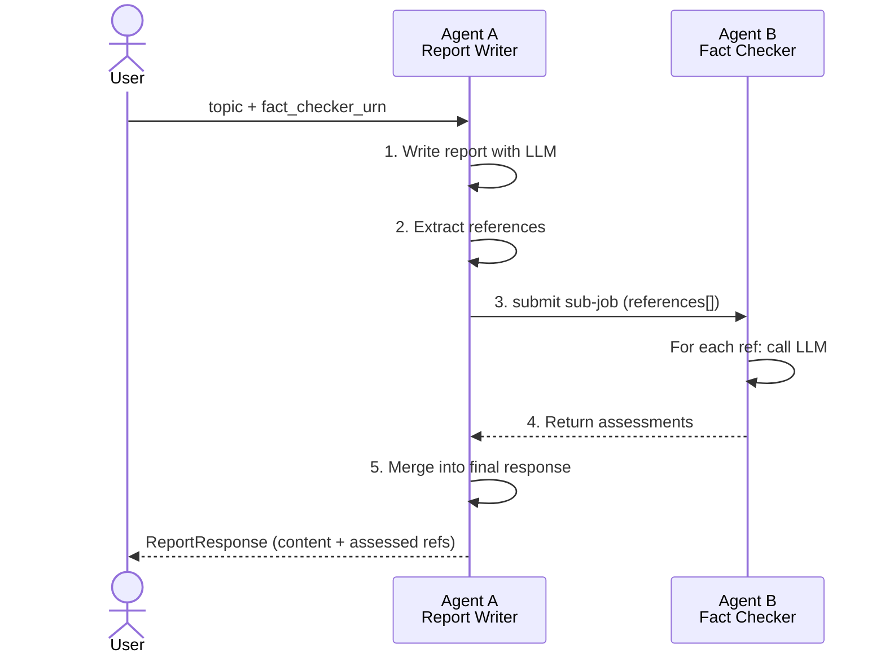

# Multi-Agent Orchestration

This guide covers composing multiple IVCAP agent services into a coherent
multi-agent system. Unlike single-service orchestration (where one service
calls sub-jobs), multi-agent composition means **each agent is an independently
deployed IVCAP service** — with its own container, resource allocation, versioning,
and provenance record — and agents call each other by URN.

The worked example here is drawn from the
[agent-calling-agent tutorial](https://github.com/ivcap-works/agent-calling-agent-tutorial).

---

## Why compose agents?

A single service that does everything creates resource, testing, and reuse problems:

| Problem | Multi-agent solution |
|---|---|
| **Resource mismatch** | Each agent runs in its own container with the resources it needs; a GPU-intensive agent doesn't inflate the cost of a lightweight text processor |
| **Testing friction** | Each agent can be tested independently with simple JSON requests |
| **Reuse** | A fact-checker or a PDF converter is useful to many callers; deployed as its own service, any agent or human can invoke it directly |
| **Independent deployment** | Update or replace one agent without touching the others |

---

## The composition model

In IVCAP, **any agent can call any other agent** by its service URN. The caller:

1. Receives the callee's URN as part of its own request (not hardcoded)
2. Fetches the callee's schema via `ctxt.ivcap.get_agent(urn)` at runtime
3. Builds a typed, validated request from that schema
4. Submits a sub-job and waits for the result

The callee does not know who is calling it — it is a self-contained service.



---

## Example: Report Writer + Fact Checker

### The Fact Checker — a standalone agent

The Fact Checker is a completely self-contained service. It takes a list of
references and returns an LLM assessment of each one's credibility. It has
no knowledge of the Report Writer.

```python
from pydantic import BaseModel, ConfigDict, Field
from typing import Optional, List
from ivcap_service import getLogger, Service
from ivcap_ai_tool import start_tool_server, ivcap_ai_tool, ToolOptions, logging_init

logging_init()
logger = getLogger("app")

service = Service(
    name="Fact Checker Agent",
    description="Assesses the credibility and relevance of a list of references.",
)

class FactCheckInput(BaseModel):
    jschema: str = Field(
        "urn:sd:schema:a2a-tutorial.fact-checker.request.1", alias="$schema"
    )
    references: List[str] = Field(..., description="List of references to check")
    model: Optional[str] = Field("gpt-4o", description="LLM model to use")
    temperature: Optional[float] = Field(0.3)

class ReferenceAssessment(BaseModel):
    reference: str
    assessment: str

class FactCheckOutput(BaseModel):
    jschema: str = Field(
        "urn:sd:schema:a2a-tutorial.fact-checker.1", alias="$schema"
    )
    results: List[ReferenceAssessment]


@ivcap_ai_tool("/", opts=ToolOptions(tags=["Fact Checker"], service_id="/"))
async def verify_references(input: FactCheckInput) -> FactCheckOutput:
    """Verify and assess the quality of a list of references."""
    from ivcap_service import get_llm_client
    llm = get_llm_client()
    verified = []
    for ref in input.references:
        response = llm.chat.completions.create(
            model=input.model,
            messages=[
                {"role": "system", "content": "You are a critical academic reviewer."},
                {"role": "user",   "content": f"Assess the credibility and relevance of: {ref}"},
            ],
            temperature=input.temperature,
        )
        verified.append(ReferenceAssessment(
            reference=ref,
            assessment=response.choices[0].message.content,
        ))
    return FactCheckOutput(results=verified)

if __name__ == "__main__":
    start_tool_server(service)
```

!!! note "`service_id=\"/\"`"
    Setting `service_id="/"` in `ToolOptions` publishes the service schema at its own
    root path. This is required for `get_agent()` to introspect the schema when another
    service calls it. Any service you want to call as an agent should include this.

### The Report Writer — an agent that calls another agent

The Report Writer writes a report on a topic, extracts the references from the
LLM output, and delegates fact-checking to whatever Fact Checker service URN
was passed in the request.

```python
from pydantic import BaseModel, ConfigDict, Field
from typing import List, Optional
from ivcap_service import getLogger, Service, JobContext
from ivcap_ai_tool import start_tool_server, ivcap_ai_tool, ToolOptions, logging_init

logging_init()
logger = getLogger("app")

service = Service(
    name="Report Writer Agent",
    description="Writes a report and validates references with a separate fact-checker agent.",
)

class FactCheckerConfig(BaseModel):
    agent_id: str = Field(..., description="URN of the deployed Fact Checker service")
    model: Optional[str] = Field("gpt-4o")
    temperature: Optional[float] = Field(0.3)

class ReportRequest(BaseModel):
    jschema: str = Field(
        "urn:sd:schema:a2a-tutorial.report-writer.request.1", alias="$schema"
    )
    topic: str = Field(..., description="Topic to write about")
    fact_checker: Optional[FactCheckerConfig] = Field(
        None, description="If provided, references are verified by this agent"
    )
    model: Optional[str] = Field("gpt-4o")
    temperature: Optional[float] = Field(0.7)

class ReferenceWithAssessment(BaseModel):
    reference: str
    assessment: Optional[str] = None

class ReportResponse(BaseModel):
    jschema: str = Field(
        "urn:sd:schema:a2a-tutorial.report-writer.1", alias="$schema"
    )
    topic: str
    content: str
    references: List[ReferenceWithAssessment]


@ivcap_ai_tool("/", opts=ToolOptions(tags=["Report Writer"]))
def generate_report(request: ReportRequest, ctxt: JobContext) -> ReportResponse:
    """Write a report on a topic and fact-check its references using a separate agent."""
    from ivcap_service import get_llm_client
    llm = get_llm_client()

    # Step 1: Ask the LLM to write the report
    response = llm.chat.completions.create(
        model=request.model,
        messages=[
            {"role": "system", "content": "You are a science writer."},
            {"role": "user",   "content": f"""
Write a concise summary about "{request.topic}".
Include at least 2 well-formatted references at the end like:
[1] Author/Source - URL
[2] Author/Source - URL
"""},
        ],
        temperature=request.temperature,
    )
    report_text = response.choices[0].message.content

    # Step 2: Extract lines that look like references
    references = [
        line.strip()
        for line in report_text.splitlines()
        if line.strip().startswith("[")
    ]

    # Step 3: Optionally delegate to the Fact Checker agent
    if not request.fact_checker:
        return ReportResponse(
            topic=request.topic,
            content=report_text,
            references=[ReferenceWithAssessment(reference=r) for r in references],
        )

    # Look up the Fact Checker by URN — schema discovery at runtime
    agent = ctxt.ivcap.get_agent(request.fact_checker.agent_id)
    req_model = agent.request_model
    req = req_model(
        references=references,
        model=request.fact_checker.model,
        temperature=request.fact_checker.temperature,
    )

    # Submit as a sub-job and wait
    job = agent.exec_agent(req)
    if not job.succeeded:
        raise RuntimeError(f"Fact checking failed: {job.error}")

    return ReportResponse(
        topic=request.topic,
        content=report_text,
        references=job.result["results"],
    )

if __name__ == "__main__":
    start_tool_server(service)
```

---

## The five-line composition pattern

The core of agent-to-agent calling is five lines worth memorising:

```python
# 1. Receive the callee's URN as a parameter (not hardcoded)
agent_urn = request.fact_checker.agent_id

# 2. Look up by URN — fetches schema from IVCAP at runtime
agent = ctxt.ivcap.get_agent(agent_urn)

# 3. Build a typed, validated request from the discovered schema
req = agent.request_model(references=references, model="gpt-4o")

# 4. Submit as a sub-job and wait for completion
job = agent.exec_agent(req)

# 5. Use the result
return job.result["results"]
```

---

## Project structure

Each agent is its own Poetry project with independent dependencies, `Dockerfile`,
and deployment configuration. They share nothing at the code level — only the
IVCAP API:

```
agent-calling-agent/
├── fact_checker/
│   ├── pyproject.toml
│   ├── Dockerfile
│   └── fact_checker.py
└── report_writer/
    ├── pyproject.toml
    ├── Dockerfile
    └── report_writer.py
```

Each `pyproject.toml` specifies a different local port so both can run at the
same time during development:

```toml
# fact_checker/pyproject.toml
[tool.poetry-plugin-ivcap]
service-file = "fact_checker.py"
service-type = "lambda"
port = 8077

# report_writer/pyproject.toml
[tool.poetry-plugin-ivcap]
service-file = "report_writer.py"
service-type = "lambda"
port = 8078
```

---

## Testing locally

Start each service in a separate terminal:

```bash
# Terminal 1
cd fact_checker && poetry ivcap run

# Terminal 2
cd report_writer && poetry ivcap run
```

Test the Fact Checker directly:

```bash
curl -s -X POST -H "content-type: application/json" \
  --data '{
    "$schema": "urn:sd:schema:a2a-tutorial.fact-checker.request.1",
    "references": ["[1] NASA Solar System Exploration - https://solarsystem.nasa.gov/"]
  }' \
  http://localhost:8077 | jq '.results[0]'
```

Test the Report Writer without fact-checking (no agent URN needed locally):

```bash
curl -s -X POST -H "content-type: application/json" \
  --data '{
    "$schema": "urn:sd:schema:a2a-tutorial.report-writer.request.1",
    "topic": "The Solar System"
  }' \
  http://localhost:8078 | jq '.content'
```

---

## Deploying and running on IVCAP

Deploy the Fact Checker first — the Report Writer needs its URN:

```bash
cd fact_checker
git add . && git commit -m "fact checker v1"
poetry ivcap deploy
# → INFO: service definition successfully uploaded — urn:ivcap:service:1c107789-...
```

Then deploy the Report Writer:

```bash
cd report_writer
git add . && git commit -m "report writer v1"
poetry ivcap deploy
```

Run the full pipeline with fact-checking enabled:

```bash
# report_writer/tests/solar.json
{
  "$schema": "urn:sd:schema:a2a-tutorial.report-writer.request.1",
  "topic": "The Solar System",
  "fact_checker": {
    "agent_id": "urn:ivcap:service:1c107789-c5f4-51c4-b086-8a09e0fb39c0"
  }
}
```

```bash
cd report_writer
poetry ivcap job-exec tests/solar.json
```

Expected output:

```yaml
topic: The Solar System
content: >-
  The Solar System consists of the Sun and all objects bound to it by gravity ...

  References:
  [1] NASA Solar System Exploration - https://solarsystem.nasa.gov/...
  [2] European Space Agency (ESA) - https://www.esa.int/...

references:
  - reference: "[1] NASA Solar System Exploration - ..."
    assessment: "This reference is highly credible. NASA is a leading authority ..."
  - reference: "[2] European Space Agency (ESA) - ..."
    assessment: "ESA is a reputable intergovernmental organisation ..."
```

---

## Provenance of multi-agent runs

Every sub-job is a first-class IVCAP job. When the Report Writer submits a
Fact Checker job, IVCAP records:

- The Fact Checker sub-job with its own `urn:ivcap:job:<uuid>`
- The parent–child link between the Report Writer job and the Fact Checker job
- All input and output artifacts for both jobs

```bash
# Inspect the provenance of the parent job
ivcap aspect list --entity urn:ivcap:job:<report-writer-job-uuid>
```

This gives you the complete execution graph — which agents ran, in what order,
with what inputs, producing which outputs — queryable after the fact.

---

## Design considerations

### Make the callee optional

The Report Writer's `fact_checker` field is `Optional`. When omitted, the service
still produces a useful report — just without assessments. This makes the service
usable standalone and lets you add fact-checking incrementally:

```python
if not request.fact_checker:
    return ReportResponse(
        references=[ReferenceWithAssessment(reference=r) for r in references]
    )
```

### Pass the callee's URN at runtime, not at deploy time

The Report Writer never has the Fact Checker's URN hardcoded. It receives it as
a parameter from the caller. This means:

- Any compatible fact-checker can be substituted (a faster one, a domain-specific one)
- The Fact Checker can be updated without redeploying the Report Writer
- The URN can come from a user, an AI agent, or a configuration file

### Schema introspection provides loose coupling

The Report Writer never imports `FactCheckInput`. It discovers the schema at runtime
via `agent.request_model`. If the schema changes incompatibly, you see a validation
error at call time, not a broken import.

### Independent resourcing

The Fact Checker and Report Writer can have different resource limits. A
fact-checker that calls an LLM API needs low memory and good network latency.
A service that runs a local embedding model needs significant RAM. With separate
deployments, each gets exactly what it needs.

---

## Extending to more agents

The same pattern scales to any number of agents. A coordinator can call
three, five, or ten specialist agents — each discovered by URN, each running
in parallel or in sequence, each with its own provenance:

```python
# Fan-out to multiple specialist agents
agents = {
    "fire":   ctxt.ivcap.get_agent(req.fire_checker_id),
    "flood":  ctxt.ivcap.get_agent(req.flood_checker_id),
    "drought": ctxt.ivcap.get_agent(req.drought_checker_id),
}

jobs = {
    name: agent.exec_agent(agent.request_model(region=req.region))
    for name, agent in agents.items()
}

results = {name: job.result for name, job in jobs.items() if job.succeeded}
```

---

## Next steps

[→ CrewAI on IVCAP](crewai.md){ .md-button .md-button--primary }
[→ Agent Patterns](agent-patterns.md){ .md-button }
[→ Full tutorial on GitHub](https://github.com/ivcap-works/agent-calling-agent-tutorial){ .md-button }
