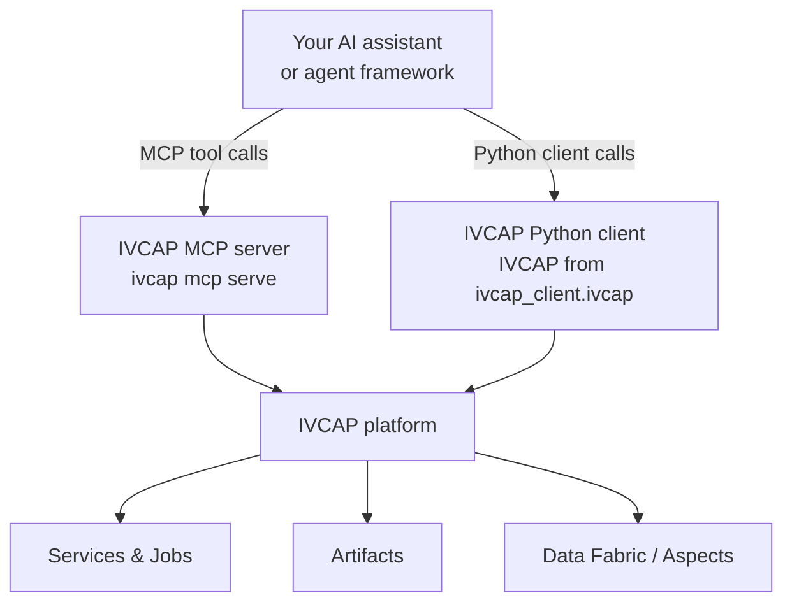

# Using IVCAP from External Agents

You do not need to deploy a service to use IVCAP as part of an agent workflow.
The `ivcap` CLI includes a built-in **Model Context Protocol (MCP) server** that
exposes the full IVCAP API as a set of tools, usable by any MCP-compatible AI
assistant or agent framework.

This means you can build agent workflows *outside* IVCAP — in Claude Desktop, an
LLM Studio session, a Jupyter Notebook, or your own Python code — while IVCAP acts
as the managed execution and data backend:



---

## What IVCAP exposes as tools

Whether you use the MCP server or the Python client, you can:

| Capability | What you can do |
|---|---|
| **Service discovery** | List services, inspect parameter schemas |
| **Job submission** | Submit jobs to any registered service, monitor progress |
| **Artifact management** | Upload inputs, download results |
| **Data Fabric queries** | Query aspects and provenance by entity, schema, or content |
| **Utility services** | Invoke built-in tools like `PDF to Markdown` before passing documents to an LLM |

---

## The IVCAP MCP server

The MCP server is built into the `ivcap` CLI. Once running, it exposes all of the
above capabilities as named MCP tools that any compliant client can call.

### Starting the server

First, ensure you are authenticated:

```bash
ivcap context login
```

Then start the server:

```bash
ivcap mcp serve          # stdio transport (default, used by most clients)

# or, for network clients:
ivcap mcp serve --transport sse --port 3001
```

### Available MCP tools

| Tool | What it does |
|---|---|
| `list_services` | List all registered services |
| `get_service` | Get details and parameter schema for a service |
| `submit_job` | Submit a job to a service |
| `get_job` | Get the status and result of a job |
| `list_jobs` | List recent jobs |
| `upload_artifact` | Upload a file and get its artifact URN |
| `download_artifact` | Download an artifact by URN |
| `list_artifacts` | List accessible artifacts |
| `query_aspects` | Query the Data Fabric for aspects |
| `get_aspect` | Get a specific aspect by URN |

---

## Claude Desktop

Add IVCAP to your Claude Desktop configuration. On macOS:

```bash
# Edit ~/Library/Application Support/Claude/claude_desktop_config.json
```

```json
{
  "mcpServers": {
    "ivcap": {
      "command": "ivcap",
      "args": ["mcp", "serve"],
      "env": {
        "IVCAP_CONTEXT": "my-deployment"
      }
    }
  }
}
```

Replace `my-deployment` with your `ivcap` context name (set with `ivcap context create`).
Restart Claude Desktop.

Once connected, you can interact in plain language:

> "What services are available on IVCAP?"

> "Submit a fire risk analysis job for region Tasmania-North with threshold 0.05,
> then show me the result when it's done."

> "Upload this PDF and convert it to Markdown using the IVCAP PDF-to-Markdown service."

> "Show me all jobs that ran in the last week and what artifacts they produced."

Claude will call the appropriate MCP tools (`list_services`, `submit_job`, `get_job`,
etc.) and return results in a readable form.

!!! tip "Using IVCAP to pre-process documents for Claude"
    A powerful pattern is to use IVCAP's `PDF to Markdown` service to convert a PDF
    to clean Markdown text, then paste or upload the Markdown to Claude for analysis.
    With the MCP server, this is a single natural-language request:
    > "Convert `urn:ivcap:artifact:abc123` to Markdown, then summarise the key findings."

---

## LLM Studio environments

LLM Studio environments (such as [LM Studio](https://lmstudio.ai/),
[Jan](https://jan.ai/), or [Open WebUI](https://openwebui.com/)) that support MCP
tool servers can be connected to IVCAP in the same way as Claude Desktop.

### LM Studio

In LM Studio, go to **Settings → Tools → Add MCP Server** and enter:

| Field | Value |
|---|---|
| Command | `ivcap` |
| Arguments | `mcp serve` |
| Environment | `IVCAP_CONTEXT=my-deployment` |

Once saved, any chat session with a function-calling model will have access to the
IVCAP tools. This lets a locally running LLM submit jobs to a cloud IVCAP deployment
and retrieve results.

### Open WebUI

Open WebUI supports MCP tool servers via the **Tools** section. Add the IVCAP MCP
server using the SSE transport:

```bash
# Start the IVCAP MCP server in SSE mode
ivcap mcp serve --transport sse --port 3001
```

Then in Open WebUI: **Settings → Tools → Add Tool Server** → `http://localhost:3001`.

---

## Jupyter Notebooks

Jupyter Notebooks are a natural environment for exploratory agent workflows —
iterative, inspectable, and easy to share. IVCAP can be used from notebooks in
two ways:

- **Python client** — directly call the IVCAP REST API from a notebook cell
- **`jupyter-ai` with MCP** — use the Jupyter AI extension's MCP support to give
  the in-notebook AI assistant access to IVCAP tools

### Option A: Python client in a notebook

The [IVCAP Python client](../integrating/python-client-sdk.md) works directly in
notebook cells. This is the most flexible approach — you write code, not prompts:

```bash
pip install ivcap-client
```

Set `IVCAP_URL` and `IVCAP_JWT` in your environment or a `.env` file first
(see [Authentication](../integrating/authentication.md)):

```bash
export IVCAP_URL=https://api.your-ivcap-deployment.net
export IVCAP_JWT=$(ivcap context get access-token)
```

```python
# Cell 1: connect
from ivcap_client.ivcap import IVCAP
ivcap = IVCAP()

# Discover available services
for i, svc in enumerate(ivcap.list_services(limit=20)):
    print(f"{i}: {svc}")
```

```python
# Cell 2: upload a PDF and convert to Markdown
import time

pdf_artifact = ivcap.upload_artifact(name="paper", file_path="paper.pdf")
print(f"Uploaded: {pdf_artifact.id}")

# Convert PDF to Markdown using IVCAP's built-in service
pdf_md_svc = ivcap.get_service_by_name("PDF to Markdown")
job = pdf_md_svc.request_job({"document": pdf_artifact.id})

while not job.finished:
    time.sleep(3)
    job.refresh()

# Stream the Markdown content
md_artifact = ivcap.get_artifact(job.result["markdown_artifact"])
markdown_text = b"".join(md_artifact.as_stream()).decode("utf-8")
print(markdown_text[:2000])
```

```python
# Cell 3: submit a CrewAI runner job
crew_art = ivcap.upload_artifact(name="my_crew", file_path="my_crew.yaml")

runner = ivcap.get_service_by_name("CrewAI Runner")
crew_job = runner.request_job({
    "crew_definition": crew_art.id,
    "topic": "Battery energy storage advances 2024",
})

while not crew_job.finished:
    time.sleep(5)
    crew_job.refresh()

print(crew_job.result["report"])
```

### Option B: `jupyter-ai` with MCP support

[`jupyter-ai`](https://jupyter-ai.readthedocs.io/) is the official Jupyter AI
extension. From version 2.x it supports MCP tool servers, which means you can give
the in-notebook AI chat assistant access to IVCAP:

```bash
pip install jupyter-ai jupyter-ai-magics
```

Start the IVCAP MCP server in SSE mode (in a separate terminal):

```bash
ivcap mcp serve --transport sse --port 3001
```

Then configure `jupyter-ai` to use it. In your `jupyter_ai_config.py` or through
the JupyterLab settings UI:

```python
# jupyter_ai_config.py
c.AiExtension.mcp_servers = [
    {
        "name": "ivcap",
        "url": "http://localhost:3001",
        "transport": "sse",
    }
]
```

Once configured, the `%%ai` magic and the AI chat panel can access IVCAP:

```python
%%ai gpt-4o --tools ivcap
List the available IVCAP services, then submit a job to the
"PDF to Markdown" service using the artifact urn:ivcap:artifact:abc123.
Monitor the job and show me the first 500 characters of the result.
```

See the [`jupyter-ai` MCP documentation](https://jupyter-ai.readthedocs.io/en/latest/users/index.html#mcp-tools)
for full configuration options.

### Option C: MCP Python client in a notebook

For maximum control, use the [MCP Python SDK](https://github.com/modelcontextprotocol/python-sdk)
directly in a notebook. This lets you call IVCAP MCP tools programmatically, or embed
them in any Python agent framework:

```bash
pip install mcp
```

```python
import asyncio
from mcp import ClientSession, StdioServerParameters
from mcp.client.stdio import stdio_client

async def call_ivcap_mcp():
    server_params = StdioServerParameters(
        command="ivcap",
        args=["mcp", "serve"],
    )
    async with stdio_client(server_params) as (read, write):
        async with ClientSession(read, write) as session:
            await session.initialize()

            # List available tools
            tools = await session.list_tools()
            print([t.name for t in tools.tools])

            # List IVCAP services
            result = await session.call_tool("list_services", {})
            print(result.content)

            # Submit a job
            result = await session.call_tool("submit_job", {
                "service_id": "urn:ivcap:service:<uuid>",
                "parameters": {"topic": "ocean acidification"}
            })
            print(result.content)

asyncio.run(call_ivcap_mcp())
```

---

## Custom agent frameworks

If you are building your own agent using OpenAI function calling, LangChain, or
another framework, you can integrate IVCAP either:

- **Via the MCP Python SDK** (see above) — wrap the MCP tools as native function
  definitions in your framework
- **Via the IVCAP Python client** — call the REST API directly and build your own
  tool wrappers

### Example: wrapping IVCAP as OpenAI function tools

```python
from ivcap_client.ivcap import IVCAP
import time

ivcap = IVCAP()

def submit_fire_risk_analysis(region: str, threshold: float = 0.05) -> dict:
    """Submit a fire risk analysis job to IVCAP and return the result."""
    svc = ivcap.get_service_by_name("Fire Risk Analysis")
    job = svc.request_job({"region": region, "threshold": threshold})
    while not job.finished:
        time.sleep(5)
        job.refresh()
    if job.status() != "succeeded":
        return {"error": job.status()}
    return job.result

# Register as an OpenAI tool
TOOLS = [
    {
        "type": "function",
        "function": {
            "name": "submit_fire_risk_analysis",
            "description": "Run a fire risk analysis for a region on IVCAP",
            "parameters": {
                "type": "object",
                "properties": {
                    "region": {"type": "string"},
                    "threshold": {"type": "number"},
                },
                "required": ["region"],
            },
        },
    }
]

TOOL_FUNCTIONS = {"submit_fire_risk_analysis": submit_fire_risk_analysis}
```

---

## Security considerations

The MCP server inherits the authenticated identity of the `ivcap` CLI context.
It can only access resources that your account has permission to use.

!!! warning "Do not expose the MCP server publicly"
    The `stdio` transport is local-only. If you use `--transport sse`, ensure
    the port is firewalled or protected by an authentication proxy. The MCP server
    itself does not add an additional authentication layer.

---

## Choosing between external and internal agents

| Factor | External agent | Internal IVCAP service |
|---|---|---|
| **Where agent logic runs** | On your machine / in your environment | On IVCAP, in a managed container |
| **Provenance of agent steps** | Not tracked by IVCAP | Fully tracked (sub-jobs, artifacts, aspects) |
| **Deployment required** | No | Yes (container + `poetry ivcap deploy`) |
| **Best for** | Exploration, ad-hoc analysis, notebook workflows | Production, reproducibility, reuse |
| **LLM credentials** | Managed by your environment | Managed by IVCAP sidecar (no keys in code) |

The two approaches are complementary. A typical research workflow might use an
external agent (Jupyter + MCP) to explore and prototype, then promote the polished
logic to an internal IVCAP service for production execution.

---

## Next steps

[→ Agent Patterns](agent-patterns.md){ .md-button .md-button--primary }
[→ CrewAI on IVCAP](crewai.md){ .md-button }
[→ Using IVCAP via MCP (full reference)](../integrating/mcp.md){ .md-button }
