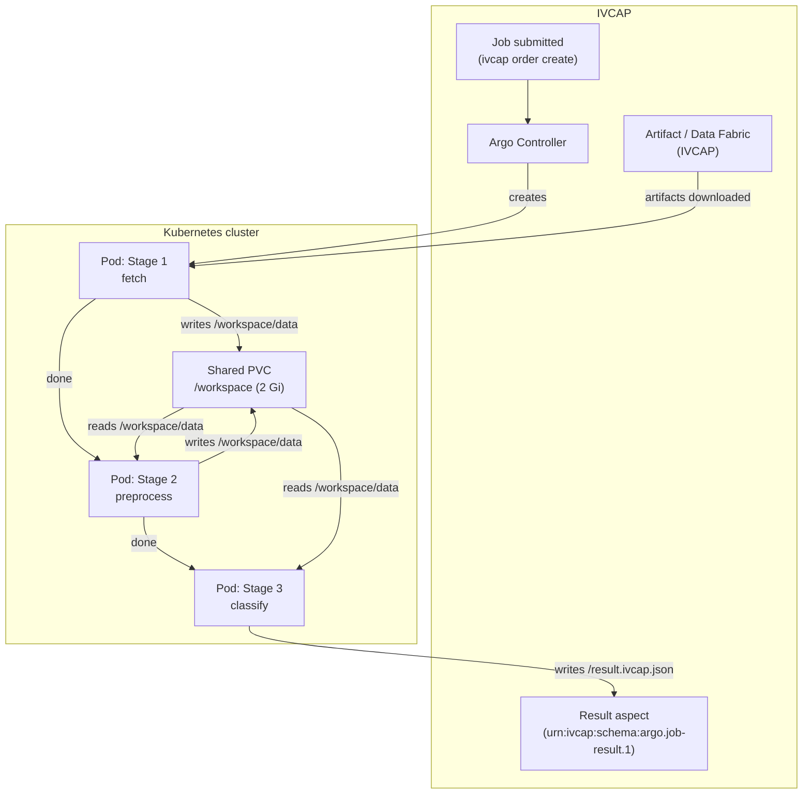

# Building and Deploying Argo Workflows

IVCAP supports **Argo Workflows** as a first-class service type.
An Argo Workflow service lets you define a multi-stage pipeline where each
stage runs in its own Kubernetes pod, stages share a persistent volume, and
the result is returned to IVCAP's provenance system when the final stage
completes.

The running example is [ivcap-argo-example ↗](https://github.com/ivcap-works/ivcap-argo-example){target="_blank"} — a three-stage bird-species
classification pipeline using EfficientNetB2.

## Contents

- [When to use Argo Workflows](#when-to-use-argo-workflows)
- [Architecture overview](#architecture-overview)
- [Step 1: Structure your project](#step-1-structure-your-project)
- [Step 2: Write the Dockerfile](#step-2-write-the-dockerfile)
- [Step 3: Build and push the Docker image](#step-3-build-and-push-the-docker-image)
- [Step 4: Write the Argo Workflow YAML](#step-4-write-the-argo-workflow-yaml)
- [Step 5: Write the `ivcap.yml` service definition](#step-5-write-the-ivcapyml-service-definition)
- [Step 6: Merge and register the service](#step-6-merge-and-register-the-service)
- [Step 7: Submit and monitor a job](#step-7-submit-and-monitor-a-job)
- [Writing the result file](#writing-the-result-file-resultivcapjson)
- [Reading IVCAP artifacts in a stage](#reading-ivcap-artifacts-in-a-stage)
- [Troubleshooting](#troubleshooting)

---

## When to use Argo Workflows

Use a basic (lambda/batch) service when your analysis fits in a single
container. Use an Argo Workflow when you need:

| Need | Argo advantage |
|---|---|
| Sequential stages with different resource profiles | Each stage gets its own pod CPU/memory allocation |
| Stages that share large intermediate data | Shared PVC at `/workspace` — no round-trip through the artifact store |
| Reusable stage logic across pipelines | Parameterised templates compose cleanly |
| Long-running pipelines (> typical HTTP timeout) | Argo controller manages pod lifecycle independently |

---

## Architecture overview



---

## Step 1: Structure your project

A typical Argo Workflow project contains:

```
my-pipeline/
├── dispatcher.py              # Entry point — routes --stage to stage functions
├── stage1_fetch.py            # Stage 1 logic
├── stage2_process.py          # Stage 2 logic
├── stage3_output.py           # Stage 3 logic
├── run.sh                     # Thin shell wrapper: exec python dispatcher.py "$@"
├── Dockerfile                 # Single image for all stages
├── image-classify-workflow.yaml   # Argo Workflow definition
├── ivcap.yml                  # IVCAP service definition
├── merge-ivcap-workflow.sh    # Merges the two YAML files for registration
└── Makefile                   # Convenience targets
```

### Single image vs multiple images

You can use **one Docker image** for all stages (recommended for simpler
projects) or a **separate image per stage** for larger pipelines with different
dependencies.

The single-image approach uses a `dispatcher.py` entry point that routes
execution based on a `--stage` argument:

```python
# dispatcher.py
import argparse, importlib, sys

STAGES = {
    "fetch":      "stage1_fetch",
    "preprocess": "stage2_process",
    "classify":   "stage3_output",
}

def main():
    parser = argparse.ArgumentParser()
    parser.add_argument("--stage", required=True, choices=STAGES)
    args, rest = parser.parse_known_args()
    module = importlib.import_module(STAGES[args.stage])
    sys.exit(module.run(rest))

if __name__ == "__main__":
    main()
```

And a minimal shell wrapper `run.sh` that Docker calls:

```bash
#!/usr/bin/env bash
set -euo pipefail
exec python dispatcher.py "$@"
```

---

## Step 2: Write the Dockerfile

A single `Dockerfile` containing all stage dependencies:

```dockerfile
FROM python:3.11-slim-bookworm

RUN pip install --no-cache-dir poetry

WORKDIR /app
COPY pyproject.toml poetry.lock ./
RUN poetry config virtualenvs.create false \
 && poetry install --no-root --only main

COPY . .

# Make the shell wrapper executable
RUN chmod +x run.sh

# Inject git commit hash at build time for reproducibility
ARG VERSION=dev
ENV VERSION=$VERSION

ENTRYPOINT ["./run.sh"]
```

---

## Step 3: Build and push the Docker image

IVCAP requires a **`linux/amd64`** image even if you develop on Apple Silicon.
Use `docker buildx` to cross-compile:

```bash
# Set the image name to the IVCAP registry path
DOCKER_IMAGE="$(ivcap package target my-pipeline)"
GIT_COMMIT=$(git rev-parse --short HEAD)
DOCKER_TAG="${GIT_COMMIT}"

docker buildx build \
    -t "${DOCKER_IMAGE}_amd64:${DOCKER_TAG}" \
    --platform linux/amd64 \
    --load \
    --build-arg VERSION="${GIT_COMMIT}" \
    .
```

Push the image to the IVCAP registry:

```bash
ivcap package push "${DOCKER_IMAGE}_amd64:${DOCKER_TAG}"
```

Retrieve the fully-qualified image reference (you need this in the workflow
YAML):

```bash
IVCAP_IMAGE=$(ivcap package list "${DOCKER_IMAGE}_amd64:${DOCKER_TAG}")
echo "Image reference: ${IVCAP_IMAGE}"
```

!!! tip "Automate with Make"
    The [example Makefile ↗](https://github.com/ivcap-works/ivcap-argo-example/blob/main/Makefile){target="_blank"}
    defines `make ivcap-docker-publish` to run these steps in one command.

---

## Step 4: Write the Argo Workflow YAML

The Argo Workflow YAML describes the pipeline topology, templates (one per
stage), shared volumes, and output parameters.

```yaml
# image-classify-workflow.yaml
apiVersion: argoproj.io/v1alpha1
kind: Workflow
metadata:
  generateName: bird-classify-
  labels:
    demo: efficientnetb2-birds
spec:
  entrypoint: pipeline

  # ── Parameters injected by IVCAP at job submission ──────────────────────────
  arguments:
    parameters:
      - name: collection_urn        # IVCAP collection of input images
      - name: model_artifact_urn    # IVCAP artifact containing the model weights
      - name: limit
        value: "0"                  # 0 = process all images

  # ── Shared workspace PVC ─────────────────────────────────────────────────────
  # All pods mount /workspace; stages pass data through files on this volume.
  volumeClaimTemplates:
    - metadata:
        name: workspace
      spec:
        accessModes: ["ReadWriteOnce"]
        resources:
          requests:
            storage: 2Gi

  # ── Top-level pipeline ────────────────────────────────────────────────────────
  templates:
    - name: pipeline
      steps:
        - - name: fetch
            template: fetch-model-and-images
        - - name: preprocess
            template: preprocess-images
        - - name: classify
            template: classify-images

      # IVCAP reads the final result from the workflow-level outputs
      outputs:
        parameters:
          - name: result
            valueFrom:
              parameter: "{{steps.classify.outputs.parameters.result}}"

    # ── Stage 1: Fetch ────────────────────────────────────────────────────────
    - name: fetch-model-and-images
      container:
        image: "@DOCKER_IMAGE@"   # placeholder replaced at registration time
        command: ["./run.sh"]
        args:
          - --stage
          - fetch
          - --collection-urn
          - "{{workflow.parameters.collection_urn}}"
          - --model-artifact-urn
          - "{{workflow.parameters.model_artifact_urn}}"
          - --limit
          - "{{workflow.parameters.limit}}"
          - --out-dir
          - /workspace/data
        volumeMounts:
          - name: workspace
            mountPath: /workspace
        resources:
          requests: { memory: "512Mi", cpu: "250m" }
          limits:   { memory: "1Gi",   cpu: "500m" }

    # ── Stage 2: Preprocess ───────────────────────────────────────────────────
    - name: preprocess-images
      container:
        image: "@DOCKER_IMAGE@"
        command: ["./run.sh"]
        args:
          - --stage
          - preprocess
          - --in-dir
          - /workspace/data
          - --out-dir
          - /workspace/data
        volumeMounts:
          - name: workspace
            mountPath: /workspace
        resources:
          requests: { memory: "512Mi", cpu: "500m" }
          limits:   { memory: "1Gi",   cpu: "1000m" }

    # ── Stage 3: Classify ─────────────────────────────────────────────────────
    - name: classify-images
      container:
        image: "@DOCKER_IMAGE@"
        command: ["./run.sh"]
        args:
          - --stage
          - classify
          - --in-dir
          - /workspace/data
          - --out-dir
          - /workspace/data
        env:
          # IVCAP result file path — must match the outputs.parameters path below
          - name: IVCAP_RESULT_PATH
            value: "/result.ivcap.json"
        volumeMounts:
          - name: workspace
            mountPath: /workspace
        resources:
          requests: { memory: "1Gi",  cpu: "1000m" }
          limits:   { memory: "2Gi",  cpu: "2000m" }
      # Argo captures this file after the container exits.
      # IVCAP then reads it from wf.Status.Outputs.Parameters["result"].
      outputs:
        parameters:
          - name: result
            valueFrom:
              path: /result.ivcap.json
```

### Key conventions

| Convention | Why |
|---|---|
| `@DOCKER_IMAGE@` placeholder in `image:` | Replaced with the real registry reference at registration time |
| `IVCAP_RESULT_PATH=/result.ivcap.json` env var | Tells your stage 3 code where to write the result that IVCAP will read |
| Workflow-level `outputs.parameters[result]` | IVCAP Argo controller reads this to attach the result as a provenance aspect |
| `volumeClaimTemplates` instead of `emptyDir` | Each workflow execution gets its own PVC; cleaner isolation |

---

## Step 5: Write the `ivcap.yml` service definition

`ivcap.yml` declares the service metadata, the request schema, and tells IVCAP
to use the Argo controller:

```yaml
# ivcap.yml
$id: urn:ivcap:service:7c9e66d9-74fa-4c8e-8f55-1d39b8204f14
$schema: urn:ivcap:schema.service.2

name: bird-classification-argo
description: |
  A three-stage Argo Workflow that classifies bird species using EfficientNetB2.
  Stages: fetch → preprocess → classify.
contact:
  name: Jane Smith
  email: jane@example.org

# ── Request schema ─────────────────────────────────────────────────────────────
# These properties become the job parameters that callers pass at submission time.
request-schema:
  $id: urn:ivcap.tutorial:schema:bird-classify-pipeline.request.1
  $schema: http://json-schema.org/draft-07/schema#
  type: object
  title: Bird classification pipeline request
  required:
    - collection_urn
    - model_artifact_urn
  properties:
    collection_urn:
      type: string
      description: >
        IVCAP collection URN whose items are individual bird image artifacts.
        Create with: make prepare-data
      pattern: '^urn:ivcap:collection:[a-f0-9\-]+$'
      example: 'urn:ivcap:collection:5f3a9c12-1b2e-4d8a-9f7e-3c0b1d2e5f6a'
    model_artifact_urn:
      type: string
      description: >
        IVCAP artifact URN containing the EfficientNetB2 model weights.
        Create once with: make prepare-model
      pattern: '^urn:ivcap:artifact:[a-f0-9\-]+$'
      example: 'urn:ivcap:artifact:0b7d5c7e-ba9f-46a1-a80d-0dc6bb5a9b90'
    limit:
      type: integer
      description: Max images to process (0 = all).
      minimum: 0
      default: 0

# ── Tell IVCAP to use the Argo controller ─────────────────────────────────────
controller-schema: urn:ivcap:schema.service.argo.1
controller:
  $schema: urn:ivcap:schema.service.argo.1
  # The Argo Workflow spec is merged in from image-classify-workflow.yaml
  # by merge-ivcap-workflow.sh before registration (see Step 6).
```

!!! note "Service ID"
    Generate a stable UUID for your `$id` with `python3 -c "import uuid; print(uuid.uuid4())"` and keep it constant across deployments. IVCAP uses this URN to identify the service — changing it creates a new service.

---

## Step 6: Merge and register the service

The service definition and workflow YAML are kept as separate files for
readability. The `merge-ivcap-workflow.sh` script merges them before
registration, and `sed` substitutes the `@DOCKER_IMAGE@` placeholder:

```bash
# 1. Build and push the image (Step 3)
make ivcap-docker-publish

# 2. Merge ivcap.yml + workflow YAML
./merge-ivcap-workflow.sh ivcap.yml image-classify-workflow.yaml \
    ivcap-service-with-workflow.yaml

# 3. Substitute the actual image reference
IVCAP_IMAGE=$(ivcap package list "${DOCKER_IMAGE}_amd64:${GIT_COMMIT}")
sed -i "s|@DOCKER_IMAGE@|${IVCAP_IMAGE}|g" ivcap-service-with-workflow.yaml

# 4. Register (or update) the service on the platform
ivcap df update ${SERVICE_ID} -f ivcap-service-with-workflow.yaml
```

Or run everything in one step:

```bash
make register-service
```

Verify the service appeared in the catalogue:

```bash
ivcap service list
ivcap service get urn:ivcap:service:<your-uuid>
```

---

## Step 7: Submit and monitor a job

```bash
ivcap order create urn:ivcap:service:<uuid> \
    collection_urn="urn:ivcap:collection:<col-uuid>" \
    model_artifact_urn="urn:ivcap:artifact:<art-uuid>" \
    limit=10 \
    --watch
```

The `--watch` flag streams live status as each Argo stage progresses:

```
ORDER  urn:ivcap:job:a2acc877-d125-47d2-8922-4ce665f044a9
STATUS pending → running → succeeded
STAGE  fetch      ✓  (12s)
STAGE  preprocess ✓  (8s)
STAGE  classify   ✓  (23s)
```

Retrieve the result aspect:

```bash
ivcap df get urn:ivcap:job:<uuid>
```

The IVCAP Argo controller automatically attaches the workflow output
(`result.ivcap.json`) as an aspect on the job entity with schema
`urn:ivcap:schema:argo.job-result.1`.

---

## Writing the result file (`result.ivcap.json`)

The final stage must write a JSON file to the path in `IVCAP_RESULT_PATH`
(default `/result.ivcap.json`). IVCAP reads this file from the Argo workflow
outputs and attaches it as a provenance aspect on the job.

```python
# stage3_output.py (excerpt)
import json, os
from pathlib import Path

def run(argv):
    ...
    results = run_inference(...)

    result_path = Path(os.environ.get("IVCAP_RESULT_PATH", "/result.ivcap.json"))
    result_path.parent.mkdir(parents=True, exist_ok=True)
    result_path.write_text(json.dumps(results, indent=2))
    return 0
```

The file must fit within etcd's value limit (~256 KB). For large outputs,
write summary statistics to `result.ivcap.json` and upload the full data as
an IVCAP artifact from within the stage.

---

## Reading IVCAP artifacts in a stage

Stages access IVCAP artifacts and collections using the `ivcap-service`
Python SDK and the credentials injected by the IVCAP sidecar:

```python
# stage1_fetch.py (excerpt)
from ivcap_service import get_ivcap_url, get_session

def run(argv):
    args = parse_args(argv)
    session = get_session()          # uses sidecar-injected credentials
    ivcap_url = get_ivcap_url()

    # Download model artifact
    resp = session.get(f"{ivcap_url}/1/artifacts/{artifact_id}/content",
                       stream=True)
    ...

    # Iterate a collection
    resp = session.get(f"{ivcap_url}/1/aspects",
                       params={"schema": "urn:ivcap:schema:collection-item.1",
                               "entity": collection_urn,
                               "limit": limit or 500})
    for item in resp.json()["items"]:
        image_urn = item["content"]["item"]   # artifact URN of each image
        ...
```

---

## Troubleshooting

| Symptom | Likely cause | Fix |
|---|---|---|
| Stage pod fails with `ImagePullBackOff` | Image not pushed or wrong tag | Re-run `make ivcap-docker-publish`; check `ivcap package list` |
| `@DOCKER_IMAGE@` appears in the merged YAML | Merge step ran before push | Always run `make register-service` (which depends on `ivcap-docker-publish`) |
| Stage 2 can't find stage 1 outputs | PVC not shared or wrong path | Confirm all templates reference the same volume name (`workspace`) and path |
| Job stays `pending` | Argo controller not installed or not running | Run `kubectl get pods -n argo` |
| Result not attached to job | `result.ivcap.json` not written or wrong path | Check `IVCAP_RESULT_PATH` env var and stage 3 code |
| Result too large (controller error) | Result JSON > 256 KB | Upload payload as artifact; write only URN + summary to result file |

---

## Complete example

The full source for the bird classification pipeline shown in this guide is at:

[→ ivcap-works/ivcap-argo-example ↗](https://github.com/ivcap-works/ivcap-argo-example){ .md-button target="_blank" }

---

## Next steps

[→ Deploy a basic service](../building/deploy.md){ .md-button }
[→ Call Other Services](../building/call-other-services.md){ .md-button }
[→ Use Queues](../building/use-queues.md){ .md-button }
