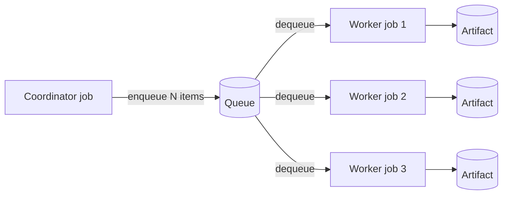

# Using Queues

**Queues** provide asynchronous message passing between services and pipeline stages.
Instead of one service directly calling another and waiting, a producer enqueues work
items that one or more consumers dequeue and process independently — at their own pace.

---

## When to use queues

| Use queues when… | Use direct sub-jobs when… |
|---|---|
| Processing is **bursty** — many work items arrive faster than they can be processed | You need the result immediately and the job is short-lived |
| You want **fan-out** — N worker services consuming from a shared work list | There is a simple one-to-one request/response relationship |
| Work items arrive **continuously** over time (streaming pipeline) | You are building an interactive workflow and polling for completion |
| The producer should **not wait** for each item to be processed before submitting the next | |

---

## Queue concepts

| Concept | What it means |
|---|---|
| **Queue URN** | `urn:ivcap:queue:<uuid>` — stable identifier for the queue |
| **Message** | A JSON object enqueued and dequeued; content is arbitrary |
| **Receipt handle** | Token returned with each dequeued message; used to acknowledge processing |
| **Visibility timeout** | If a borrowed message is not acknowledged, it becomes visible again |

---

## Creating a queue

=== "CLI"

    ```bash
    ivcap queue create --name "image-pipeline"
    # → urn:ivcap:queue:7f8a9b0c-...
    ```

=== "REST"

    ```json
    POST /1/queues

    {
      "name":   "image-pipeline",
      "policy": "urn:ivcap:policy:private"
    }
    ```

=== "Python (from within a service)"

    ```python
    queue = ctxt.ivcap.create_queue(
        name="image-pipeline",
        policy="urn:ivcap:policy:private",
    )
    print(f"Queue: {queue.id}")
    ```

---

## Producer: enqueuing messages

A **producer** service discovers work items (e.g. all artifacts matching a schema)
and enqueues them:

```python
from ivcap_service import JobContext

def producer(req: Request, ctxt: JobContext) -> Result:
    ivcap = ctxt.ivcap
    queue_urn = req.queue_urn   # queue URN passed as a parameter

    # Find all artifacts to process
    artifacts = list(ivcap.list_artifacts(
        schema="urn:ivcap:schema:remote-sensing:scene.1"
    ))

    enqueued = 0
    for artifact in artifacts:
        ivcap.enqueue_message(
            queue_id=queue_urn,
            content={
                "artifact": artifact.id,
                "model": req.model_version,
                "priority": "normal",
            }
        )
        enqueued += 1

    return Result(enqueued=enqueued, queue=queue_urn)
```

---

## Consumer: dequeuing and processing

A **consumer** service polls the queue, processes each item, and acknowledges it:

```python
def consumer(req: Request, ctxt: JobContext) -> Result:
    ivcap = ctxt.ivcap
    queue_urn = req.queue_urn
    processed = 0

    while True:
        # Dequeue a batch of messages
        messages = ivcap.dequeue_messages(queue_id=queue_urn, limit=5)

        if not messages:
            # Queue is empty — we're done
            break

        for msg in messages:
            try:
                # Process the work item
                artifact_urn = msg.content["artifact"]
                model_version = msg.content.get("model", "latest")

                result_artifact = run_model(
                    ivcap=ivcap,
                    artifact_urn=artifact_urn,
                    model=model_version,
                )

                # Acknowledge — message is removed from the queue
                ivcap.ack_message(
                    queue_id=queue_urn,
                    receipt_handle=msg.receipt_handle,
                )
                processed += 1

            except Exception as e:
                logger.error(f"Failed to process {msg.id}: {e}")
                # Don't ack — message will reappear after visibility timeout

    return Result(processed=processed)
```

!!! warning "Always ack after successful processing"
    A message that is dequeued but not acknowledged will reappear on the queue after
    the visibility timeout expires and be re-delivered to another consumer. Only
    acknowledge after you have successfully processed and saved the result.

---

## Fan-out pattern

A common pipeline architecture: one coordinator enqueues all work, then multiple
workers consume in parallel.



The coordinator and workers are separate IVCAP services, deployed independently.
Users submit a coordinator job with a queue URN; the coordinator enqueues all work
items and exits. Workers are submitted as separate jobs (by the coordinator or by
the user) and process items until the queue is empty.

### Coordinator service

```python
@ivcap_ai_tool("/", opts=ToolOptions(tags=["Pipeline"]))
def coordinate(req: Request, ctxt: JobContext) -> Result:
    """Discover all matching artifacts and enqueue them for processing."""
    ivcap = ctxt.ivcap

    artifacts = list(ivcap.list_artifacts(schema=req.input_schema))
    for art in artifacts:
        ivcap.enqueue_message(
            queue_id=req.queue_urn,
            content={"artifact": art.id, "params": req.processing_params}
        )

    return Result(enqueued=len(artifacts), queue=req.queue_urn)
```

### Worker service

```python
@ivcap_ai_tool("/", opts=ToolOptions(tags=["Pipeline"]))
def work(req: Request, ctxt: JobContext) -> Result:
    """Drain the queue: process each artifact and upload results."""
    ivcap = ctxt.ivcap
    processed = 0

    while True:
        messages = ivcap.dequeue_messages(queue_id=req.queue_urn, limit=1)
        if not messages:
            break

        msg = messages[0]
        artifact_urn = msg.content["artifact"]

        # Download, process, upload result
        doc = ivcap.get_artifact(artifact_urn)
        output = process(doc.as_file())
        out_art = ivcap.upload_artifact(
            name=f"result-{doc.name}",
            io_stream=io.BytesIO(output),
            content_type="application/json",
            content_size=len(output),
            policy=req.policy,
        )

        ivcap.ack_message(
            queue_id=req.queue_urn,
            receipt_handle=msg.receipt_handle,
        )
        processed += 1

    return Result(processed=processed)
```

---

## Standing orders: trigger on new data

A **standing order** creates a live queue that is automatically populated whenever
a new artifact matching a filter expression arrives on the platform. Workers run
continuously, processing new items as they appear.

This pattern supports:

- **Image ingestion pipelines** — process each frame as it uploads
- **Closed-loop experiments** — react to new sensor readings automatically
- **Streaming analytics** — continuously apply a model to a live data stream

Create a standing order via the CLI:

```bash
ivcap standing-order create \
    --name "process-new-scenes" \
    --service urn:ivcap:service:<worker-uuid> \
    --filter "schema=urn:ivcap:schema:remote-sensing:scene.1" \
    --queue-param "queue_urn"
```

---

## Queue API reference

| Method | Path | Python equivalent |
|---|---|---|
| `POST /1/queues` | Create queue | `ivcap.create_queue(name=...)` |
| `GET /1/queues` | List queues | `ivcap.list_queues()` |
| `GET /1/queues/{id}` | Get queue details | `ivcap.get_queue(queue_id)` |
| `POST /1/queues/{id}/messages` | Enqueue | `ivcap.enqueue_message(queue_id, content=...)` |
| `GET /1/queues/{id}/messages` | Dequeue | `ivcap.dequeue_messages(queue_id, limit=N)` |
| `DELETE /1/queues/{id}` | Delete queue | `ivcap.delete_queue(queue_id)` |

---

## Provenance in pipelines

Every consumer job that processes a queue message is a regular IVCAP job with its own
URN and provenance aspects. Input artifacts and output artifacts are linked automatically
— even across a high-throughput pipeline processing thousands of items.

```bash
# Find all jobs that consumed a specific artifact
ivcap aspect list \
    --entity urn:ivcap:artifact:<uuid> \
    --schema urn:ivcap:schema:artifact-usedBy-order.1
```

---

## Common patterns

### Checking queue depth before starting workers

```python
queue = ivcap.get_queue(queue_urn)
print(f"Queue depth: {queue.message_count}")

if queue.message_count == 0:
    return Result(processed=0, message="Nothing to do")
```

### Dead-letter handling

Messages that fail processing repeatedly will block the queue. Use a try/except
around the processing step and log failures with enough detail to investigate:

```python
try:
    process(msg)
    ivcap.ack_message(queue_id, msg.receipt_handle)
except Exception as e:
    logger.error(
        f"Failed to process message {msg.id} after attempt",
        extra={"artifact": msg.content.get("artifact"), "error": str(e)}
    )
    # Do NOT ack — let the visibility timeout return it to the queue
    # After max_receive_count retries, the platform moves it to the dead-letter queue
```

---

## Next steps

[→ Service Basics](service-basics.md){ .md-button }
[→ Call Other Services](call-other-services.md){ .md-button }

For the concepts behind queues and pipeline patterns, see:

[→ Queues concept guide](../../concepts/queues.md){ .md-button }
