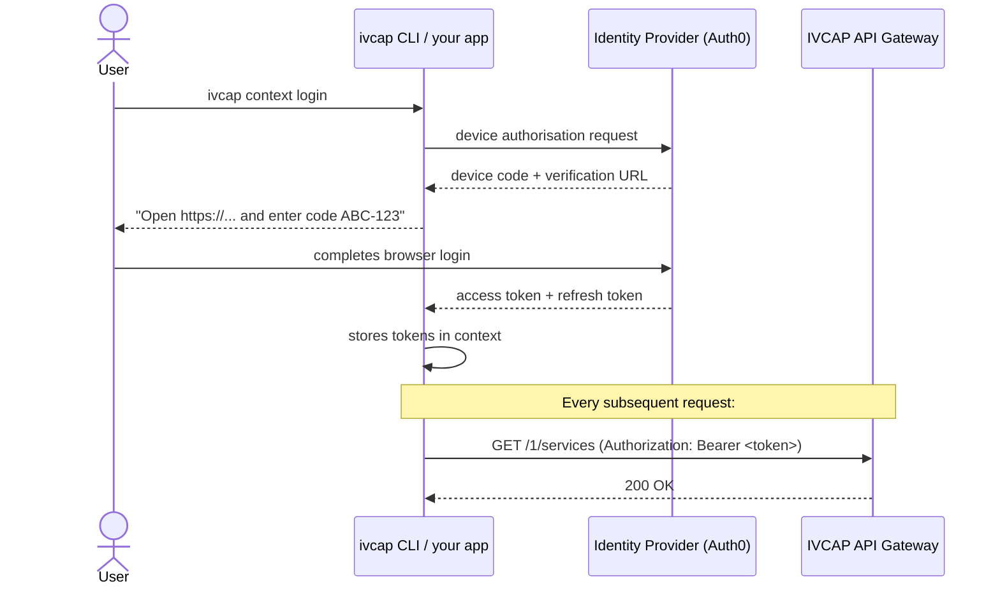

# Authentication

All IVCAP API calls require a **JWT Bearer token**. The token identifies you to the
platform and controls which services, artifacts, and aspects you can access.

---

## How authentication works

IVCAP delegates authentication to an external **identity provider** (IdP) — Auth0 by
default, but configurable per deployment. The IdP issues short-lived JWT tokens that
IVCAP validates on every request.



The token has an expiry time (typically 1–24 hours). The CLI handles refresh
automatically. If you are using the REST API directly, you must refresh the token
before it expires using the refresh token flow.

---

## Discovering the identity provider

Every IVCAP deployment documents its configured identity providers at:

```
GET <base-url>/1/authinfo.yaml
```

```bash
curl -s https://api.<your-deployment>.ivcap.net/1/authinfo.yaml
```

The response lists the IdP name, the device authorisation endpoint, the token
endpoint, and the client ID to use. This is the authoritative source for your
deployment's auth configuration.

---

## Authenticating via the CLI

The CLI is the easiest way to authenticate. It handles the device flow, stores
tokens securely, and refreshes them automatically.

### Step 1: Create a context

A context holds the API base URL and credentials for one deployment. Create one per
environment (development, staging, production):

```bash
ivcap context create my-deployment https://api.<your-deployment>.ivcap.net
```

### Step 2: Log in

```bash
ivcap context login
```

The CLI opens your browser (or prints a URL and code if the browser is unavailable).
Complete the login in the browser. When successful:

```
Logged in as jane.smith@example.com (urn:ivcap:account:...)
```

Tokens are stored locally (typically in `~/.ivcap/`). All subsequent `ivcap`
commands use them automatically.

### Step 3: Verify

```bash
ivcap context get
```

```
Context: my-deployment
URL:     https://api.<your-deployment>.ivcap.net
Account: urn:ivcap:account:45a06508-...
User:    jane.smith@example.com
Status:  authenticated
```

### Switching between deployments

```bash
# List all configured contexts
ivcap context list

# Switch to a different deployment
ivcap context use staging

# Log in to the new context
ivcap context login
```

---

## Authenticating from code

### Python client SDK

The Python client reads its credentials from the `IVCAP_URL` and `IVCAP_JWT`
environment variables (or a `.env` / `.dbg-env` file in the working directory):

```python
from ivcap_client.ivcap import IVCAP

# Reads IVCAP_URL and IVCAP_JWT from environment or .env file
ivcap = IVCAP()
```

The easiest way to populate those variables is via the CLI:

```bash
export IVCAP_URL=https://api.your-ivcap-deployment.net
export IVCAP_JWT=$(ivcap context get access-token)
```

Or put them in a `.env` file in your project directory:

```ini
# .env
IVCAP_URL=https://api.your-ivcap-deployment.net
IVCAP_JWT=<your-jwt-token>
```

See [Python Client SDK](python-client-sdk.md) for full credential configuration details.

### REST API directly

Include the token in the `Authorization` header on every request:

```bash
curl -H "Authorization: Bearer <your-jwt-token>" \
     https://api.<your-deployment>.ivcap.net/1/services
```

To obtain a token programmatically (device auth flow):

```bash
# Step 1: Get the deployment's auth info
AUTH_INFO=$(curl -s https://api.<your-deployment>.ivcap.net/1/authinfo.yaml)
DEVICE_AUTH_URL=$(echo "$AUTH_INFO" | grep device_authorization_endpoint | awk '{print $2}')
TOKEN_URL=$(echo "$AUTH_INFO" | grep token_endpoint | awk '{print $2}')
CLIENT_ID=$(echo "$AUTH_INFO" | grep client_id | awk '{print $2}')

# Step 2: Request a device code
DEVICE=$(curl -s -X POST "$DEVICE_AUTH_URL" \
  -d "client_id=$CLIENT_ID" \
  -d "scope=openid profile email offline_access")

echo "Visit: $(echo $DEVICE | jq -r .verification_uri_complete)"
DEVICE_CODE=$(echo $DEVICE | jq -r .device_code)

# Step 3: Poll for the token
TOKEN_RESPONSE=$(curl -s -X POST "$TOKEN_URL" \
  -d "client_id=$CLIENT_ID" \
  -d "grant_type=urn:ietf:params:oauth:grant-type:device_code" \
  -d "device_code=$DEVICE_CODE")

ACCESS_TOKEN=$(echo $TOKEN_RESPONSE | jq -r .access_token)
REFRESH_TOKEN=$(echo $TOKEN_RESPONSE | jq -r .refresh_token)
```

### Refreshing an expired token

```bash
TOKEN_RESPONSE=$(curl -s -X POST "$TOKEN_URL" \
  -d "client_id=$CLIENT_ID" \
  -d "grant_type=refresh_token" \
  -d "refresh_token=$REFRESH_TOKEN")

ACCESS_TOKEN=$(echo $TOKEN_RESPONSE | jq -r .access_token)
```

---

## Authenticating in CI/CD

For non-interactive environments (GitHub Actions, GitLab CI, automated scripts),
use a service account token rather than the device flow.

### Option A: Environment variables

Set `IVCAP_URL` and `IVCAP_JWT` in your CI/CD secret store and export them before
running your script:

```bash
# In your CI/CD environment (GitHub Actions, GitLab CI, etc.)
export IVCAP_URL="https://api.<your-deployment>.ivcap.net"
export IVCAP_JWT="<service-account-jwt-token>"
```

```python
from ivcap_client.ivcap import IVCAP

# Picks up IVCAP_URL and IVCAP_JWT from the environment automatically
ivcap = IVCAP()
```

### Option B: `.env` file injected at build time

Write a `.env` file to your working directory (e.g., from a secret manager) before
your script runs:

```ini
IVCAP_URL=https://api.<your-deployment>.ivcap.net
IVCAP_JWT=<service-account-jwt-token>
```

The SDK reads `.env` automatically on `IVCAP()` instantiation — no code changes
needed.

---

## Token lifetime and expiry

| Token type | Typical lifetime | Refreshable? |
|---|---|---|
| Access token | 1–24 hours | Yes (use refresh token) |
| Refresh token | 30–90 days | Yes (use refresh token to rotate) |
| Service account token | Configured per account | Depends on IdP config |

When the access token expires:

- **CLI:** automatically refreshes using the stored refresh token. No action needed.
- **Python client:** re-run `ivcap context get access-token` and update `IVCAP_JWT` (or re-generate your `.env` file).
- **REST API:** detect `401 Unauthorized` responses and re-issue the token refresh flow.

---

## Error responses

An expired or invalid token returns:

```json
HTTP/1.1 401 Unauthorized
{
  "id":     "urn:ivcap:error:...",
  "status": 401,
  "code":   "unauthorized",
  "detail": "token has expired"
}
```

A valid token without permission to access a resource returns:

```json
HTTP/1.1 403 Forbidden
{
  "status": 403,
  "code":   "forbidden",
  "detail": "you do not have access to urn:ivcap:service:..."
}
```

---

## Security notes

!!! warning "Store tokens securely"
    Never commit tokens to source control. Use environment variables, secret
    managers (AWS Secrets Manager, GCP Secret Manager, HashiCorp Vault), or your
    CI/CD platform's built-in secret storage.

!!! info "Token scope"
    IVCAP tokens are scoped to the account that authenticated. Within an account,
    access is further controlled by **policies** attached to services, artifacts,
    and aspects. An authenticated user can only access resources their account's
    policies permit.

---

## See also

- [Installing the CLI](../../getting-started/install.md) — first-time setup
- [Python Client SDK](python-client-sdk.md) — using tokens from Python
- [REST API Primer](rest-api-primer.md) — full request/response details
