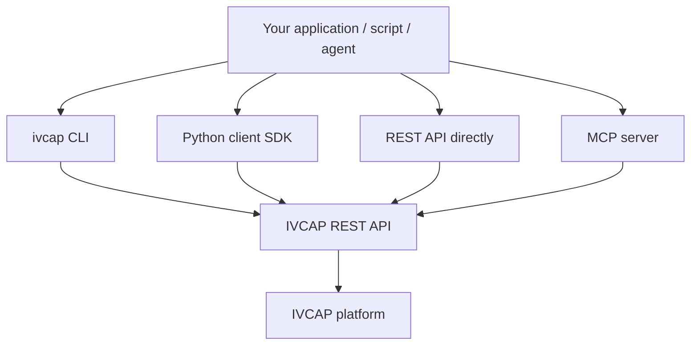
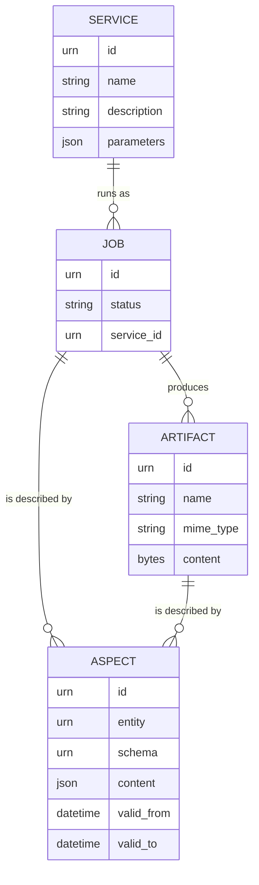

# Integrating with IVCAP

IVCAP is accessed entirely through a single REST API. Three integration paths sit on
top of that API, each suited to different audiences and use cases:

| Path | Best for |
|---|---|
| **CLI** (`ivcap`) | Manual exploration, shell scripts, CI/CD pipelines |
| **Python client SDK** (`ivcap-client`) | Jupyter notebooks, Python applications, custom agents |
| **REST API** | Non-Python integrations, full control, any HTTP client |
| **MCP server** (`ivcap mcp serve`) | AI assistants — Claude, Cursor, Cline, LLM Studio |

All paths require [authentication](authentication.md) — a JWT bearer token obtained
from the deployment's identity provider.

---

## Which path should I use?

### I want to explore IVCAP interactively

Use the **CLI**. Install it, log in with `ivcap context login`, and you can list
services, submit jobs, upload artifacts, and query provenance with simple commands.
See [Installing the CLI](../../getting-started/install.md).

### I'm building a Python application or notebook

Use the **Python client SDK** (`ivcap-client`). It wraps the REST API and handles
authentication, pagination, and file uploads automatically. Works in Jupyter
notebooks, data pipelines, and standalone scripts.
See [Python Client SDK](python-client-sdk.md).

### I'm integrating from a non-Python language (Go, TypeScript, Java, …)

Use the **REST API directly**. Every IVCAP deployment publishes a live OpenAPI 3
specification at `/1/openapi/openapi3.json`. Import it into Insomnia, Postman, or
your code generator of choice.
See [REST API Primer](rest-api-primer.md).

### I want an AI assistant to control IVCAP

Use the **MCP server** built into the CLI. Start it with `ivcap mcp serve` and
connect any MCP-compatible AI assistant (Claude Desktop, Cursor, Cline, LLM Studio).
See [Using IVCAP via MCP](mcp.md).

---

## The integration model

All four paths talk to the same API. Understanding the four core resource types
helps you work with any of them:

| Resource | URN pattern | What it is |
|---|---|---|
| **Service** | `urn:ivcap:service:<uuid>` | A registered analytic capability with defined parameters |
| **Job** | `urn:ivcap:job:<uuid>` | A single execution of a service |
| **Artifact** | `urn:ivcap:artifact:<uuid>` | Any binary or structured data blob stored in the platform |
| **Aspect** | `urn:ivcap:aspect:<uuid>` | Typed, time-stamped metadata attached to any entity URN |

Every action you perform through any integration path maps to operations on these
four resource types.

---

## What's in this section

| Guide | Content |
|---|---|
| [Authentication](authentication.md) | How to obtain and use JWT tokens; device auth flow; token refresh |
| [Python Client SDK](python-client-sdk.md) | Installing and using `ivcap-client` from Python |
| [REST API Primer](rest-api-primer.md) | Key endpoints, request/response formats, pagination, errors |
| [Using IVCAP via MCP](mcp.md) | Connecting AI assistants to IVCAP via the built-in MCP server |
