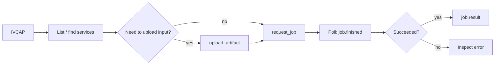

# Python Client SDK

The `ivcap-client` package provides a Python interface to the IVCAP REST API.
It handles authentication, pagination, file uploads, and error handling, so you
can focus on your workflow rather than HTTP details.

> Full SDK reference: [ivcap-works.github.io/ivcap-client-sdk-python](https://ivcap-works.github.io/ivcap-client-sdk-python/)

!!! note "Two different SDKs"
    IVCAP has two separate Python packages with different purposes:

    | Package | Purpose |
    |---|---|
    | `ivcap-client` | **This page.** For use from *outside* IVCAP — notebooks, scripts, agents |
    | `ivcap-service` + `ivcap-ai-tool` | For use *inside* a service container — see [Calling Other Services](../building/call-other-services.md) |

---

## Installation

```bash
pip install ivcap-client
```

Or with Poetry:

```bash
poetry add ivcap-client
```

---

## Credentials

The SDK reads two environment variables:

| Variable | Required | Description |
|---|---|---|
| `IVCAP_URL` | Yes | Base URL of the IVCAP platform API, e.g. `https://api.your-ivcap-deployment.net` |
| `IVCAP_JWT` | Yes | JWT access token for authentication |

**Get a JWT from the CLI:**

```bash
# Print the current access token from the active ivcap context
ivcap context get access-token
```

**Set the variables for your session:**

```bash
export IVCAP_URL=https://api.your-ivcap-deployment.net
export IVCAP_JWT=$(ivcap context get access-token)
```

**Or use a `.env` / `.dbg-env` file (recommended for development):**

```ini
# .env
IVCAP_URL=https://api.your-ivcap-deployment.net
IVCAP_JWT=<your-jwt-token>
```

The SDK picks up `.env` and `.dbg-env` files automatically when `IVCAP()` is
instantiated. Tokens expire — refresh with `ivcap context get access-token` when
needed.

---

## Connecting

```python
from ivcap_client.ivcap import IVCAP

# Reads IVCAP_URL and IVCAP_JWT from the environment or .env file
ivcap = IVCAP()
```

---

## Typical workflow



---

## Discovering services

```python
from ivcap_client.ivcap import IVCAP

ivcap = IVCAP()

# List all accessible services (lazy iterator — pages fetched automatically)
for i, service in enumerate(ivcap.list_services(limit=50)):
    print(f"{i}: {service}")

# Filter by name pattern (OData-style ~= contains operator)
for service in ivcap.list_services(filter="name~='fire-risk%'", limit=10):
    print(service)

# Sort by name
for service in ivcap.list_services(order_by="name", order_desc=False):
    print(service)

# Find a service by exact name
service = ivcap.get_service_by_name("hello-world-python")
print(service)

# Get a service by URN
service = ivcap.get_service("urn:ivcap:service:<uuid>")
print(service)
```

**Inspecting service parameters:**

```python
service = ivcap.get_service_by_name("Fire Risk Analysis")

for name, param in service.parameters.items():
    print(f"  {name}: type={param.type}, optional={param.is_optional}")
```

---

## Submitting jobs

### Simple (synchronous)

```python
import time

service = ivcap.get_service_by_name("hello-world-python")

# Submit with a plain dict — keys match the service's parameter names
job = service.request_job({"msg": "Hello, IVCAP!"})
print(f"Created job: {job.id}")

# Poll until done
while not job.finished:
    time.sleep(5)
    job.refresh()

print("Status:", job.status())
print("Result:", job.result)
```

### With a typed Pydantic request model

The SDK generates a Pydantic model matching the service's parameter schema.
This gives you IDE completion and validation before submitting:

```python
service = ivcap.get_service_by_name("Fire Risk Analysis")

# Build and validate the request model
req_model = service.request_model(
    region="Tasmania-North",
    threshold=0.05,
    input_data="urn:ivcap:artifact:<uuid>",
)

job = service.request_job(req_model)
```

### Async API

The SDK fully supports `asyncio`. Use the `_async` variants for use in async
applications, notebooks with async kernels, or agent frameworks:

```python
import asyncio

async def run():
    svc = ivcap.get_service("urn:ivcap:service:<uuid>")
    req_model = await svc.request_model_async()
    passreq = req_model(msg="Hello async")

    # Submit and wait for completion
    job = await svc.request_job_async(passreq)
    result = await job.result_async()
    print(result)

asyncio.run(run())
```

---

## Working with artifacts

### Uploading

```python
# Upload from a file path — MIME type is auto-detected from the extension
artifact = ivcap.upload_artifact(
    name="my-dataset",
    file_path="/path/to/data.csv",
)
print(f"Uploaded: {artifact.id}")   # artifact.id is the full URN

# Upload with an explicit access policy
artifact = ivcap.upload_artifact(
    name="test-image",
    file_path="/path/to/photo.jpg",
    policy="urn:ivcap:policy:ivcap.open.artifact",
)

# The returned Artifact object
print(artifact.id)        # urn:ivcap:artifact:<uuid>
print(artifact.name)      # "test-image"
print(artifact.mime_type) # "image/jpeg"
print(artifact.size)      # file size in bytes
```

Pass `artifact.id` directly as a parameter value when submitting a job:

```python
job = service.request_job({"input": artifact.id})
```

### Downloading

```python
# Retrieve artifact metadata (no bytes transferred yet)
artifact = ivcap.get_artifact("urn:ivcap:artifact:<uuid>")
print(artifact.name, artifact.mime_type)

# Stream the content to disk
output_path = "/tmp/downloaded.jpg"
with open(output_path, "wb") as f:
    for chunk in artifact.as_stream():
        f.write(chunk)
print(f"Downloaded to: {output_path}")

# Or read entirely into memory
data = b"".join(artifact.as_stream())
```

---

## Complete example: end-to-end pipeline

```python
import time
from ivcap_client.ivcap import IVCAP

ivcap = IVCAP()

# 1. Upload input PDF
pdf_artifact = ivcap.upload_artifact(
    name="paper",
    file_path="paper.pdf",
)
print(f"PDF uploaded: {pdf_artifact.id}")

# 2. Convert PDF to Markdown using a platform service
conv_svc = ivcap.get_service_by_name("PDF to Markdown")
conv_job = conv_svc.request_job({"document": pdf_artifact.id})

while not conv_job.finished:
    time.sleep(3)
    conv_job.refresh()

assert conv_job.status() == "succeeded", f"Conversion failed: {conv_job.result}"
markdown_urn = conv_job.result["markdown_artifact"]
print(f"Markdown artifact: {markdown_urn}")

# 3. Run LLM summarisation on the Markdown
summariser = ivcap.get_service_by_name("Dataset Summariser")
sum_job = summariser.request_job({"document": markdown_urn, "model": "gpt-4o"})

while not sum_job.finished:
    time.sleep(5)
    sum_job.refresh()

assert sum_job.status() == "succeeded", sum_job.result
print(sum_job.result["summary"])
```

---

## The Datafabric: aspects and metadata

Aspects are typed metadata records attached to any IVCAP entity (artifacts, jobs,
services). They underpin provenance tracking and discoverability.

### Attaching metadata to an artifact

```python
# Option A: on the artifact object directly
artifact = ivcap.get_artifact("urn:ivcap:artifact:<uuid>")
artifact.add_metadata({
    "$schema": "urn:my-project:schema:image-annotation.1",
    "label": "coral reef",
    "confidence": 0.97,
    "annotator": "alice@csiro.au",
})

# Option B: via the top-level ivcap.add_aspect method
ivcap.add_aspect(
    entity="urn:ivcap:artifact:<uuid>",
    aspect={
        "$schema": "urn:my-project:schema:image-annotation.1",
        "label": "coral reef",
        "confidence": 0.97,
    },
)
```

### Querying aspects

```python
# Search by schema (lazy iterator)
schema = "urn:my-project:schema:image-annotation.1"
for m in ivcap.list_aspects(schema=schema, include_content=True, limit=20):
    print(m.aspect)   # the JSON content dict

# Search by entity and schema
for m in ivcap.list_aspects(
    entity=artifact.id,
    schema=schema,
    include_content=True,
):
    print(m.aspect)

# OData-style filter (include_content=False is faster when you just need metadata)
filter_expr = "collection~='urn:ibenthos:collection:indo%'"
for m in ivcap.list_aspects(schema=schema, filter=filter_expr, include_content=False):
    print(m)

# Historical query: what was known at a point in time?
for m in ivcap.list_aspects(
    entity="urn:ivcap:job:<uuid>",
    at_time="2025-06-01T00:00:00Z",
    include_content=True,
):
    print(m.aspect)
```

---

## Using the SDK in Jupyter Notebooks

The SDK works directly in notebook cells. A typical notebook pattern:

```python
# Cell 1: connect (set IVCAP_URL and IVCAP_JWT in .env or env vars first)
from ivcap_client.ivcap import IVCAP
ivcap = IVCAP()
```

```python
# Cell 2: explore services
for i, svc in enumerate(ivcap.list_services(limit=20)):
    print(f"{i}: {svc}")
```

```python
# Cell 3: upload input data
artifact = ivcap.upload_artifact(name="data", file_path="data.csv")
print(artifact.id)
```

```python
# Cell 4: submit job and wait
import time
svc = ivcap.get_service_by_name("My Analysis")
job = svc.request_job({"input_data": artifact.id, "threshold": 0.1})
while not job.finished:
    time.sleep(3); job.refresh()
    print(".", end="", flush=True)
print(f"\nDone: {job.status()}")
```

```python
# Cell 5: display result
import pandas as pd
df = pd.DataFrame(job.result["data"])
df.head()
```

For Jupyter environments with async kernel support (JupyterLab ≥ 3, VS Code
notebooks), you can use the async API directly in cells without `asyncio.run()`:

```python
# Async-native cell (JupyterLab / VS Code notebooks)
svc = ivcap.get_service_by_name("My Analysis")
req = await svc.request_model_async()
job = await svc.request_job_async(req(input_data=artifact.id))
result = await job.result_async()
print(result)
```

---

## Key API summary

| Call | What it does |
|---|---|
| `IVCAP()` | Connect (reads `IVCAP_URL` + `IVCAP_JWT` from env / `.env`) |
| `ivcap.list_services(limit, filter, order_by, order_desc)` | Lazy-iterate all services |
| `ivcap.get_service(urn)` | Get a service by URN |
| `ivcap.get_service_by_name(name)` | Find a service by exact name |
| `service.parameters.items()` | Inspect parameter names, types, and optionality |
| `service.request_model(**kwargs)` | Build a typed Pydantic request object |
| `service.request_job(dict_or_model)` | Submit a job (sync) |
| `service.request_job_async(model)` | Submit a job (async) |
| `job.id` | Job URN |
| `job.finished` | `True` when job has reached a terminal state |
| `job.refresh()` | Poll the platform for updated job status |
| `job.status()` | Current status string |
| `job.result` | Output payload (dict) after completion |
| `job.result_async()` | Async version of `job.result` |
| `ivcap.upload_artifact(name, file_path, policy)` | Upload a file (MIME auto-detected) |
| `ivcap.get_artifact(urn)` | Get artifact metadata |
| `artifact.as_stream()` | Iterator of bytes chunks for download |
| `artifact.add_metadata(dict)` | Attach typed metadata to an artifact |
| `ivcap.add_aspect(entity, aspect)` | Attach an aspect to any entity |
| `ivcap.list_aspects(schema, entity, filter, include_content, at_time, limit)` | Lazy-iterate aspects |

---

## See also

- [Full SDK documentation](https://ivcap-works.github.io/ivcap-client-sdk-python/) — guides, examples, API reference
- [Authentication](authentication.md) — obtaining JWT tokens
- [REST API Primer](rest-api-primer.md) — the underlying HTTP API
- [Using IVCAP from External Agents](../agents/using-ivcap-externally.md) — agent frameworks and agentic use
