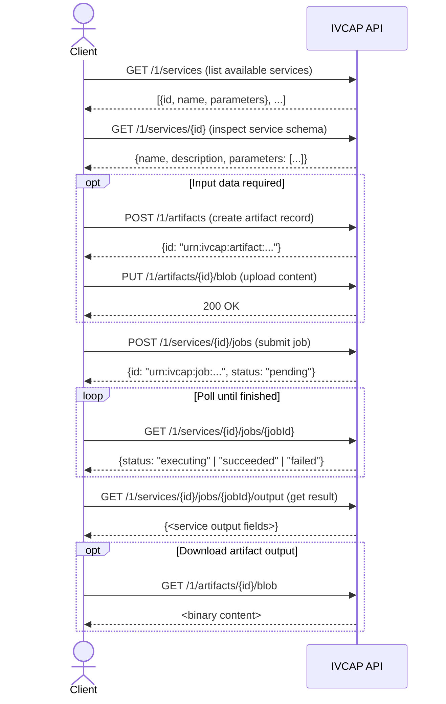
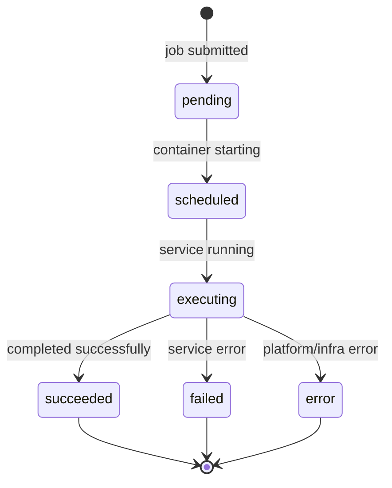

# REST API Primer

The IVCAP REST API is the single interface that all integrations use — the CLI,
the Python client SDK, and the MCP server are all wrappers around it. This page
covers the essentials for integrating directly from any HTTP client.

---

## API base URL

Every IVCAP deployment exposes its API at:

```
<scheme>://<host>/1/<resource>
```

The `/1/` prefix indicates API version 1. All public endpoints are under this prefix.

| Environment | Base URL pattern |
|---|---|
| Cloud deployment | `https://api.<your-deployment>.ivcap.net/1/` |
| Local Minikube | `http://ivcap.minikube/1/` |

---

## Authentication

All endpoints (except the OpenAPI spec and auth info) require a JWT Bearer token:

```
Authorization: Bearer <your-jwt-token>
```

See [Authentication](authentication.md) for how to obtain a token.

---

## The OpenAPI specification

Every deployment serves its full, live API specification at:

```
GET /1/openapi/openapi3.json
```

Import this into any OpenAPI-compatible tool:

- **Swagger UI** — interactive browser-based exploration
- **Insomnia** / **Postman** — API testing and collection building
- **openapi-generator** — generate a typed client in any language

```bash
# Download the spec
curl -s https://api.<your-deployment>.ivcap.net/1/openapi/openapi3.json \
  -o ivcap-openapi.json

# Or browse it interactively via Swagger UI
docker run -p 8080:8080 \
  -e SWAGGER_JSON_URL=https://api.<your-deployment>.ivcap.net/1/openapi/openapi3.json \
  swaggerapi/swagger-ui
```

---

## Typical workflow



---

## Core resources

### Services — `/1/services`

List and inspect registered analytic services.

| Method | Path | Description |
|---|---|---|
| `GET` | `/1/services` | List all accessible services |
| `GET` | `/1/services/{id}` | Get full details including parameter schema |
| `POST` | `/1/services` | Register a new service *(provider role required)* |
| `PUT` | `/1/services/{id}` | Update a service definition |

```bash
# List services
curl -H "Authorization: Bearer $TOKEN" \
  https://api.<your-deployment>.ivcap.net/1/services

# Inspect a specific service
curl -H "Authorization: Bearer $TOKEN" \
  https://api.<your-deployment>.ivcap.net/1/services/urn:ivcap:service:<uuid>
```

Service parameter types: `string`, `int`, `float`, `bool`, `artifact`
(an `urn:ivcap:artifact:...` reference).

---

### Jobs — `/1/services/{id}/jobs`

A job is a single execution of a service.

| Method | Path | Description |
|---|---|---|
| `POST` | `/1/services/{id}/jobs` | Submit a new job |
| `GET` | `/1/services/{id}/jobs` | List jobs for a service |
| `GET` | `/1/services/{id}/jobs/{jobId}` | Get job status and metadata |
| `GET` | `/1/services/{id}/jobs/{jobId}/output` | Get the result payload |
| `GET` | `/1/services/{id}/jobs/{jobId}/events` | Stream live events (SSE) |

**Submit a job:**

```bash
curl -X POST \
  -H "Authorization: Bearer $TOKEN" \
  -H "Content-Type: application/json" \
  -d '{
    "name": "fire-analysis-run-1",
    "parameters": [
      {"name": "region",     "value": "Tasmania-North"},
      {"name": "threshold",  "value": "0.05"},
      {"name": "input-data", "value": "urn:ivcap:artifact:<uuid>"}
    ]
  }' \
  https://api.<your-deployment>.ivcap.net/1/services/urn:ivcap:service:<uuid>/jobs
```

**Response:**

```json
{
  "id":     "urn:ivcap:job:<uuid>",
  "status": "pending",
  "links":  { "self": "/1/services/.../jobs/urn:ivcap:job:<uuid>" }
}
```

**Job status lifecycle:**



| Status | Meaning |
|---|---|
| `pending` | Job created; awaiting scheduling |
| `scheduled` | Execution environment starting |
| `executing` | Service is actively running |
| `succeeded` | Completed successfully |
| `failed` | Service reported a failure |
| `error` | Platform error (infrastructure, timeout) |

---

### Artifacts — `/1/artifacts`

Binary or structured data blobs stored by the platform.

| Method | Path | Description |
|---|---|---|
| `GET` | `/1/artifacts` | List accessible artifacts |
| `POST` | `/1/artifacts` | Create an artifact record |
| `GET` | `/1/artifacts/{id}` | Get artifact metadata |
| `GET` | `/1/artifacts/{id}/blob` | Download artifact content |
| `PUT` | `/1/artifacts/{id}/blob` | Upload content (≤ 16 MB, single-shot) |
| `PATCH` | `/1/artifacts/{id}/blob` | Upload via TUS resumable protocol (≤ 5 GB) |

**Uploading a file (single-shot):**

```bash
# Step 1: Create the artifact record
ARTIFACT=$(curl -s -X POST \
  -H "Authorization: Bearer $TOKEN" \
  -H "Content-Type: application/json" \
  -d '{"name": "my-dataset.csv", "mime-type": "text/csv"}' \
  https://api.<your-deployment>.ivcap.net/1/artifacts)

ARTIFACT_ID=$(echo $ARTIFACT | jq -r .id)
echo "Artifact: $ARTIFACT_ID"

# Step 2: Upload the content
curl -X PUT \
  -H "Authorization: Bearer $TOKEN" \
  -H "Content-Type: text/csv" \
  --data-binary @my-dataset.csv \
  https://api.<your-deployment>.ivcap.net/1/artifacts/$ARTIFACT_ID/blob
```

**Downloading:**

```bash
curl -H "Authorization: Bearer $TOKEN" \
  https://api.<your-deployment>.ivcap.net/1/artifacts/urn:ivcap:artifact:<uuid>/blob \
  -o output-file.csv
```

---

### Aspects — `/1/aspects`

Typed, time-stamped metadata records attached to any entity URN. Aspects are the
foundation of IVCAP's provenance model — never deleted, only appended.

| Method | Path | Description |
|---|---|---|
| `GET` | `/1/aspects` | Search aspects (`?entity=`, `?schema=`, `?at-time=`) |
| `GET` | `/1/aspects/{id}` | Get a specific aspect |
| `POST` | `/1/aspects` | Create (assert) a new aspect |
| `PUT` | `/1/aspects/{id}` | Update an aspect (retracts old, creates new) |
| `DELETE` | `/1/aspects/{id}` | Retract an aspect |

**Create an aspect:**

```bash
curl -X POST \
  -H "Authorization: Bearer $TOKEN" \
  -H "Content-Type: application/json" \
  -d '{
    "entity":  "urn:ivcap:artifact:<uuid>",
    "schema":  "urn:ivcap:schema:remote-sensing:scene.1",
    "content": {
      "sensor":           "Sentinel-2",
      "acquisition-date": "2025-04-15",
      "cloud-cover-pct":  3.2
    }
  }' \
  https://api.<your-deployment>.ivcap.net/1/aspects
```

**Query aspects:**

```bash
# All aspects on an artifact
curl -H "Authorization: Bearer $TOKEN" \
  "https://api.<your-deployment>.ivcap.net/1/aspects?entity=urn:ivcap:artifact:<uuid>"

# Aspects of a specific schema on any entity
curl -H "Authorization: Bearer $TOKEN" \
  "https://api.<your-deployment>.ivcap.net/1/aspects?schema=urn:ivcap:schema:remote-sensing:scene.1"

# Historical query: state at a specific point in time
curl -H "Authorization: Bearer $TOKEN" \
  "https://api.<your-deployment>.ivcap.net/1/aspects?entity=urn:ivcap:job:<uuid>&at-time=2025-06-01T00:00:00Z"
```

**Automatic provenance aspects** (recorded by IVCAP on every job):

| Event | Schema |
|---|---|
| Job submitted | `urn:ivcap:schema:order-placed.1` |
| Job started | `urn:ivcap:schema.job.2` |
| Artifact consumed by job | `urn:ivcap:schema:artifact-usedBy-order.1` |
| Artifact produced by job | `urn:ivcap:schema:order-produced-artifact.1` |
| Job completed | `urn:ivcap:schema:order-finished.1` |

---

### Queues — `/1/queues`

Message queues for asynchronous coordination.

| Method | Path | Description |
|---|---|---|
| `GET` | `/1/queues` | List queues |
| `POST` | `/1/queues` | Create a queue |
| `GET` | `/1/queues/{id}` | Get queue details |
| `POST` | `/1/queues/{id}/messages` | Enqueue a message |
| `GET` | `/1/queues/{id}/messages` | Dequeue message(s) |
| `DELETE` | `/1/queues/{id}` | Delete a queue |

---

## Common request patterns

### Pagination

All list endpoints support cursor-based pagination:

```
GET /1/services?limit=20
GET /1/artifacts?limit=50&page=<cursor>
GET /1/aspects?entity=...&limit=10&page=<cursor>
```

The response includes a `links.next` field with the cursor for the next page:

```json
{
  "items": [...],
  "links": {
    "self": "/1/services?limit=20",
    "next": "/1/services?limit=20&page=eyJvZmZzZXQiOjIwfQ"
  }
}
```

### Filtering

```
GET /1/services?filter=name:"Fire Risk"
GET /1/aspects?schema=urn:ivcap:schema:remote-sensing:scene.1
GET /1/aspects?entity=urn:ivcap:artifact:<uuid>&schema=<schema>
```

### Content types

- **Request bodies:** `application/json`
- **List responses:** `application/json`
- **Artifact downloads:** content-type matches the artifact's registered MIME type

---

## Error responses

All errors follow a consistent structure:

```json
{
  "id":     "urn:ivcap:error:<uuid>",
  "status": 404,
  "code":   "not-found",
  "detail": "No service with ID urn:ivcap:service:xxx was found",
  "links":  { "about": "https://docs.ivcap.net/reference/errors#not-found" }
}
```

| HTTP status | `code` | Meaning |
|---|---|---|
| 400 | `bad-request` | Malformed request body or invalid parameters |
| 401 | `unauthorized` | Missing or expired token |
| 403 | `forbidden` | Valid token but insufficient permissions |
| 404 | `not-found` | Resource does not exist |
| 409 | `conflict` | Resource already exists or state conflict |
| 422 | `unprocessable` | Request is valid JSON but fails schema validation |
| 500 | `internal-error` | Platform error — check service status |
| 503 | `unavailable` | Service temporarily unavailable |

---

## Live job events (Server-Sent Events)

To stream real-time status updates while a job runs:

```bash
curl -N \
  -H "Authorization: Bearer $TOKEN" \
  https://api.<your-deployment>.ivcap.net/1/services/<svcId>/jobs/<jobId>/events
```

Events are delivered as [CloudEvents](https://cloudevents.io/) JSON over SSE:

```
event: ivcap.job.status
data: {"id":"urn:ivcap:job:<uuid>","status":"executing","timestamp":"2025-06-01T10:00:01Z"}

event: ivcap.job.status
data: {"id":"urn:ivcap:job:<uuid>","status":"succeeded","timestamp":"2025-06-01T10:00:45Z"}
```

The stream closes when the job reaches a terminal state.

---

## Generating a client

The OpenAPI spec can generate a type-safe client in any language:

=== "TypeScript"

    ```bash
    npx @openapitools/openapi-generator-cli generate \
      -i https://api.<your-deployment>.ivcap.net/1/openapi/openapi3.json \
      -g typescript-fetch \
      -o ./ivcap-client
    ```

=== "Go"

    ```bash
    go install github.com/oapi-codegen/oapi-codegen/v2/cmd/oapi-codegen@latest
    oapi-codegen -package ivcap \
      https://api.<your-deployment>.ivcap.net/1/openapi/openapi3.json \
      > ivcap/client.go
    ```

=== "Java"

    ```bash
    npx @openapitools/openapi-generator-cli generate \
      -i https://api.<your-deployment>.ivcap.net/1/openapi/openapi3.json \
      -g java \
      --library=okhttp-gson \
      -o ./ivcap-java-client
    ```

=== "Rust"

    ```bash
    npx @openapitools/openapi-generator-cli generate \
      -i https://api.<your-deployment>.ivcap.net/1/openapi/openapi3.json \
      -g rust \
      -o ./ivcap-rust-client
    ```

---

## Worked example: full curl walkthrough

```bash
TOKEN="<your-jwt-token>"
BASE="https://api.<your-deployment>.ivcap.net"

# 1. Find the service
SVC_ID=$(curl -s -H "Authorization: Bearer $TOKEN" \
  "$BASE/1/services" | jq -r '.items[] | select(.name=="Fire Risk Analysis") | .id')
echo "Service: $SVC_ID"

# 2. Upload input data
ART=$(curl -s -X POST \
  -H "Authorization: Bearer $TOKEN" \
  -H "Content-Type: application/json" \
  -d '{"name": "sensor-data.csv", "mime-type": "text/csv"}' \
  "$BASE/1/artifacts")
ART_ID=$(echo $ART | jq -r .id)

curl -s -X PUT \
  -H "Authorization: Bearer $TOKEN" \
  -H "Content-Type: text/csv" \
  --data-binary @sensor-data.csv \
  "$BASE/1/artifacts/$ART_ID/blob"

# 3. Submit the job
JOB=$(curl -s -X POST \
  -H "Authorization: Bearer $TOKEN" \
  -H "Content-Type: application/json" \
  -d "{
    \"name\": \"fire-run-1\",
    \"parameters\": [
      {\"name\": \"region\",     \"value\": \"Tasmania-North\"},
      {\"name\": \"threshold\",  \"value\": \"0.05\"},
      {\"name\": \"input-data\", \"value\": \"$ART_ID\"}
    ]
  }" \
  "$BASE/1/services/$SVC_ID/jobs")
JOB_ID=$(echo $JOB | jq -r .id)
echo "Job: $JOB_ID"

# 4. Poll until done
while true; do
  STATUS=$(curl -s -H "Authorization: Bearer $TOKEN" \
    "$BASE/1/services/$SVC_ID/jobs/$JOB_ID" | jq -r .status)
  echo "Status: $STATUS"
  [[ "$STATUS" == "succeeded" || "$STATUS" == "failed" || "$STATUS" == "error" ]] && break
  sleep 5
done

# 5. Get the result
curl -s -H "Authorization: Bearer $TOKEN" \
  "$BASE/1/services/$SVC_ID/jobs/$JOB_ID/output" | jq .
```

---

## See also

- [Authentication](authentication.md) — tokens and the device auth flow
- [Python Client SDK](python-client-sdk.md) — higher-level Python wrapper
- [URN Reference](../../reference/urns.md) — all IVCAP identifier patterns
- [REST API Reference](../../reference/api/index.md) — full endpoint documentation
