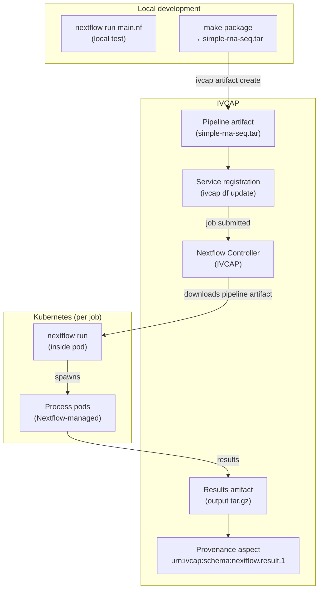
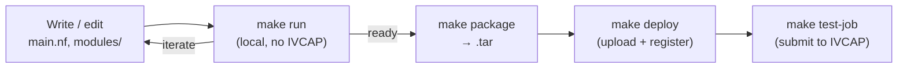

# Building and Deploying Nextflow Pipelines

IVCAP has a built-in **Nextflow controller** that lets you package any
Nextflow DSL2 pipeline as a service and run it as a reproducible,
provenance-tracked job — without rewriting a single line of Nextflow code.

This guide walks through:

1. Structuring a Nextflow project for IVCAP
2. Configuring Docker and the IVCAP weblog in `nextflow.config`
3. Writing the `ivcap.yaml` pipeline definition
4. Packaging the pipeline as a tar archive
5. Uploading and registering the service
6. Submitting a job and retrieving results

The running example is [ivcap-rnaseq-nextflow ↗](https://github.com/ivcap-works/ivcap-rnaseq-nextflow){target="_blank"} — a paired-end RNA-seq QC
pipeline using FastQC, Trim Galore, and MultiQC.

---

## When to use Nextflow on IVCAP

Use the Nextflow controller when your analysis is already written in (or
well-suited to) Nextflow DSL2. Compare with other service types:

| Service type | Best for |
|---|---|
| **Basic (lambda/batch)** | Single-container services with a Python SDK |
| **Argo Workflows** | Multi-stage pipelines with custom Docker images and shared storage |
| **Nextflow** | Existing nf-core / Nextflow DSL2 pipelines; rich tool ecosystem; per-process container management |

Key advantages of the Nextflow path:

- **No custom Docker builds required** — use existing images from Quay.io,
  Docker Hub, or nf-core directly
- **nf-core compatible** — any nf-core pipeline can be wrapped with minimal
  configuration
- **Familiar Nextflow development loop** — run locally with `nextflow run`
  exactly as you do today; IVCAP only needs the packaged pipeline scripts

---

## Architecture overview



The IVCAP Nextflow controller:

1. Downloads the pipeline tar from the artifact store
2. Runs `nextflow run main.nf` inside a Kubernetes pod
3. Nextflow manages its own process pods (one per DSL2 process execution)
4. Results are packaged and uploaded back to the artifact store
5. A provenance aspect (`urn:ivcap:schema:nextflow.result.1`) is attached to
   the job recording the results artifact URN and final status

---

## Step 1: Structure your project

```
my-pipeline/
├── main.nf                   # Nextflow DSL2 entrypoint
├── nextflow.config           # Docker + weblog configuration
├── modules/                  # DSL2 process modules
│   └── fastqc.nf
├── conf/                     # Profile-specific overrides
│   ├── test.config
│   └── weblog.disabled.config
├── data/                     # Local example inputs
│   └── paired-end.csv        # Default samplesheet for local runs
├── schema_input.json         # JSON schema for the sample sheet columns
├── ivcap.yaml                # IVCAP pipeline definition (deploy this)
├── params.json               # Default Nextflow params for local runs
└── Makefile                  # Convenience targets
```

!!! note "What gets packaged"
    Only `main.nf`, `nextflow.config`, `modules/`, `conf/`, `schema_input.json`,
    and `ivcap.yaml` are included in the deployment tar. The `data/` directory and
    `params.json` are for local development only.

---

## Step 2: Configure Docker and the IVCAP weblog

IVCAP requires two things in `nextflow.config`:

1. **Docker enabled** — every process runs in a container pulled from a public registry
2. **Weblog enabled** — Nextflow POSTs progress events to the IVCAP controller
   so job status is updated in real time

```groovy
// nextflow.config

docker.enabled      = true
docker.fixOwnership = true   // prevents root-owned files in work/

weblog {
    enabled = true
    // The IVCAP controller injects the correct URL at runtime
    url = 'http://localhost:8088'
}

profiles {
    test   { includeConfig 'conf/test.config'             }
    docker { docker.enabled = true; docker.fixOwnership = true }
}

// Prevent pipefail issues
process.shell = ['/bin/bash', '-euo', 'pipefail']

// Use a public container registry mirror (optional)
docker.registry = 'quay.io'

params {
    outdir    = 'results'
    input_csv = 'data/paired-end.csv'
    input     = null
}

// Execution reports (written to outdir/pipeline_info/)
def trace_timestamp = new java.util.Date().format('yyyy-MM-dd_HH-mm-ss')
def outdir = params.outdir
timeline { enabled = true; file = "${outdir}/pipeline_info/execution_timeline_${trace_timestamp}.html" }
report   { enabled = true; file = "${outdir}/pipeline_info/execution_report_${trace_timestamp}.html"  }
trace    { enabled = true; file = "${outdir}/pipeline_info/execution_trace_${trace_timestamp}.txt"    }
dag      { enabled = true; file = "${outdir}/pipeline_info/pipeline_dag_${trace_timestamp}.html"      }
```

Also provide a `conf/weblog.disabled.config` override for local runs where you
don't have the IVCAP controller listening:

```groovy
// conf/weblog.disabled.config
weblog.enabled = false
```

For local runs, use:
```bash
nextflow run main.nf -c nextflow.config -c conf/weblog.disabled.config \
    -params-file params.json --input data/paired-end.csv -cache false
```

---

## Step 3: Write `ivcap.yaml`

`ivcap.yaml` is the single file that describes your pipeline to IVCAP — its
parameters, sample schema, default reference assets, and an example request.

```yaml
# ivcap.yaml
$schema: urn:ivcap:schema.nextflow.pipeline.1
id: urn:sd-core:nextflow:simple-rnaseq-pipeline
name: simple-rnaseq-pipeline
service-id: urn:ivcap:service:a98b81a8-9279-509f-9c0e-40d39e83058a

description: |
  Paired-end RNA-seq QC workflow.
  Steps: FastQC → Trim Galore → (HISAT2 optional) → MultiQC.

contact:
  name: Jane Smith
  email: jane@example.org

# ── Pipeline parameters ────────────────────────────────────────────────────────
# These map directly to Nextflow --params-file entries.
properties:
  - name: hisat2_index_zip
    description: >
      URI (artifact URN or external URL) pointing to the HISAT2 index zip.
      Defaults to the built-in test index (see assets below).
    type: uri
    default: asset:hisat2_index   # references the 'hisat2_index' asset below

  - name: report_id
    description: Identifier string used in the MultiQC report filename.
    type: string
    optional: false

# ── Sample sheet schema ────────────────────────────────────────────────────────
# Each entry here becomes a column in the CSV samplesheet passed to Nextflow.
samples:
  - name: sample_name
    type: string
    description: Unique identifier for the biological sample.

  - name: fastq_1
    type: uri
    description: URN or URL of the forward (R1) FASTQ file.

  - name: fastq_2
    type: uri
    description: URN or URL of the reverse (R2) FASTQ file.

# ── Default reference assets ───────────────────────────────────────────────────
# Assets are pre-staged by the IVCAP controller before the pipeline starts.
# They can be overridden by supplying the matching property in the job request.
assets:
  - name: hisat2_index
    description: Default HISAT2 index for local testing.
    uri: https://github.com/nf-core/test-datasets/raw/refs/heads/taxprofiler/data/database/ganon/test-db-ganon.tar.gz

# ── Example job request ────────────────────────────────────────────────────────
example:
  $schema: urn:ivcap:schema:simple-rnaseq-pipeline.request.1
  parameters:
    hisat2_index_zip: https://raw.githubusercontent.com/nf-core/test-datasets/refs/heads/taxprofiler/data/database/ganon/test-db-ganon.tar.gz
    report_id: all_paired-end
  samples:
    - sample_name: ERR5766176
      fastq_1: https://raw.githubusercontent.com/nextflow-io/training/refs/heads/master/other/hands-on/data/reads/ENCSR000COQ1_1.fastq.gz
      fastq_2: https://raw.githubusercontent.com/nextflow-io/training/refs/heads/master/other/hands-on/data/reads/ENCSR000COQ1_2.fastq.gz
```

### Key fields explained

| Field | Purpose |
|---|---|
| `$schema: urn:ivcap:schema.nextflow.pipeline.1` | Tells IVCAP to use the Nextflow controller |
| `service-id` | Stable service URN — generate once with `python3 -c "import uuid; print('urn:ivcap:service:' + str(uuid.uuid4()))"` |
| `properties` | Scalar Nextflow params (maps to `--params-file`) |
| `samples` | Columns in the CSV samplesheet passed to `--input` |
| `assets` | Reference data pre-staged before the pipeline starts; `default: asset:<name>` links a property to an asset |
| `example` | Pre-filled example shown in the service catalogue and used by `make test-job` |

---

## Step 4: Package the pipeline

The IVCAP controller runs your pipeline from a tar archive — not a Docker
image. Only the Nextflow scripts and config are bundled; process containers
are pulled at runtime from public registries.

```bash
make package
```

This runs:

```bash
tar cvf simple-rna-seq.tar \
    ivcap.yaml main.nf nextflow.config \
    modules/ conf/ schema_input.json
```

!!! tip "What to include in the tar"
    Include everything Nextflow needs to execute: entry script, config,
    DSL2 modules, profile configs, and `schema_input.json`. Do **not**
    include `data/`, `work/`, `results/`, or `.nextflow/` — these are
    local-only.

---

## Step 5: Deploy the pipeline

`make deploy` does three things in sequence:

```
package → upload artifact → update service definition
```

```bash
make deploy
```

Under the hood:

```bash
# 1. Package (Step 4 above)
tar cvf simple-rna-seq.tar ivcap.yaml main.nf nextflow.config \
    modules/ conf/ schema_input.json

# 2. Upload the tar as an IVCAP artifact
PIPELINE_URN=$(ivcap artifact create \
    -n "simple-rna-seq nextflow pipeline" \
    -p urn:ivcap:policy:ivcap.open.artifact \
    -f simple-rna-seq.tar)

# 3. Register (or update) the service definition
#    @PIPELINE@ in ivcap-service.yaml is replaced with the artifact URN
cat ivcap-service.yaml \
  | sed "s|@PIPELINE@|${PIPELINE_URN}|g" \
  | ivcap df update ${SERVICE_ID} \
      -p urn:ivcap:policy:ivcap.open.metadata \
      --format yaml -f -
```

The `ivcap df update` command registers the service definition — linking the
service URN to the pipeline artifact uploaded in step 2. The IVCAP Nextflow
controller reads this definition at job submission time and downloads the
correct version of the pipeline.

Verify deployment:

```bash
ivcap service list
ivcap service get urn:ivcap:service:<your-uuid>
```

---

## Step 6: Submit and monitor a job

Create a JSON request file that matches the `example` block in your
`ivcap.yaml`:

```json
{
  "$schema": "urn:ivcap:schema:simple-rnaseq-pipeline.request.1",
  "parameters": {
    "hisat2_index_zip": "urn:ivcap:artifact:abc12345-...",
    "report_id": "run-001"
  },
  "samples": [
    {
      "sample_name": "ERR5766176",
      "fastq_1": "urn:ivcap:artifact:def67890-...",
      "fastq_2": "urn:ivcap:artifact:ghi11223-..."
    }
  ]
}
```

!!! tip "Samples can be URLs or artifact URNs"
    `fastq_1` / `fastq_2` accept either public HTTPS URLs or
    `urn:ivcap:artifact:…` URNs — the IVCAP controller handles both.

Submit the job:

```bash
ivcap job create urn:ivcap:service:<uuid> -f tests/simple_rnaseq_ivcap.json --stream
```

Or with the Makefile:

```bash
make test-job
```

The `--stream` flag prints live progress events as Nextflow stages advance:

```json
{ "type": "ivcap.job.status",  "data": { "status": "executing" } }
{ "type": "ivcap.job.event",   "data": { "name": "download pipeline", ... } }
{ "type": "ivcap.job.event",   "data": { "name": "FASTQC (3)", ... } }
{ "type": "ivcap.job.status",  "data": { "status": "succeeded" } }
```

---

## Step 7: Retrieve results

Query all aspects attached to the completed job:

```bash
ivcap datafabric query -e urn:ivcap:job:<uuid>
```

Example output:

```
 Records  ┌────┬─────────────────────────────────┬───────────────────────────────────────────┐
          │ ID │ ENTITY                          │ SCHEMA                                    │
          ├────┼─────────────────────────────────┼───────────────────────────────────────────┤
          │ @1 │ urn:ivcap:job:<uuid>            │ urn:ivcap:schema:simple-rnaseq-pipeline... │
          │ @2 │ urn:ivcap:job:<uuid>            │ urn:ivcap:schema:nextflow.result.1        │
          │ @3 │ urn:ivcap:job:<uuid>            │ urn:ivcap:schema:job.result.1             │
          └────┴─────────────────────────────────┴───────────────────────────────────────────┘
```

Read the Nextflow result aspect (`@2`):

```bash
ivcap datafabric get @2 --content-only
```

```yaml
$schema: urn:ivcap:schema:nextflow.result.1
job_id: urn:ivcap:job:<uuid>
results_artifact_urn: urn:ivcap:artifact:c6879dfc-e10a-4428-8438-13e9a81affe3
status: succeeded
```

Download the full results archive:

```bash
ivcap --silent artifact download \
    urn:ivcap:artifact:c6879dfc-e10a-4428-8438-13e9a81affe3 \
    -f - | tar ztf -
```

The archive contains everything in `results/` — FastQC HTML reports, trimming
logs, the MultiQC report, and Nextflow's own execution timeline and trace files.

---

## Local development workflow



```bash
# Local test (no IVCAP required)
make run

# Deploy and test on IVCAP
make deploy
make test-job
```

---

## Troubleshooting

| Symptom | Likely cause | Fix |
|---|---|---|
| Job stays `pending` indefinitely | Nextflow controller not running or pipeline artifact not found | Check `ivcap service get` — confirm artifact URN in service definition |
| `weblog` connection refused during local run | IVCAP controller not listening | Add `-c conf/weblog.disabled.config` to your local `nextflow run` command |
| Process fails with `permission denied` on output files | Missing `docker.fixOwnership = true` | Add to `nextflow.config` |
| No results in results artifact | Nextflow process failed silently | Check `.nextflow.log` in the downloaded results archive |
| `schema_input.json` not found by controller | Not included in tar | Add to the `tar cvf` command and to the `Makefile` package target |
| Samples not picked up | Wrong column names in samplesheet | Compare column names in `schema_input.json` with `samples[].name` in `ivcap.yaml` |

---

## Complete example

[→ ivcap-works/ivcap-rnaseq-nextflow ↗](https://github.com/ivcap-works/ivcap-rnaseq-nextflow){ .md-button target="_blank" }

---

## Next steps

[→ Argo Workflows guide](../argo-workflows/index.md){ .md-button }
[→ Deploy a basic service](../building/deploy.md){ .md-button }
[→ Use Artifacts](../building/use-artifacts.md){ .md-button }
