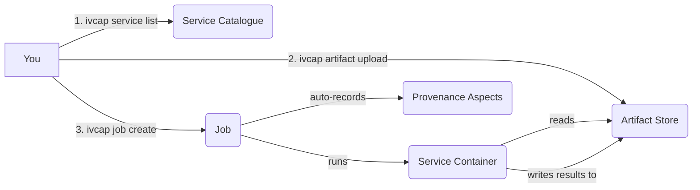

# Running Analyses

This section is for **scientists, analysts, and data engineers** who want to use existing
IVCAP services. You do not need to write any code — everything here works from the `ivcap`
CLI and the platform's REST API.

---

## What you will learn

| Guide | What you will do |
|---|---|
| [Discover Services](discover-services.md) | Find what's available, read parameter schemas, understand service capabilities |
| [Submit and Monitor Jobs](submit-jobs.md) | Create jobs, pass inputs, wait for completion, handle failures |
| [Work with Artifacts](work-with-artifacts.md) | Upload input data, download results, chain jobs together |
| [Query Provenance](query-provenance.md) | Trace where a result came from, audit job history, point-in-time queries |
| [Troubleshooting](troubleshooting.md) | Diagnose auth errors, failed jobs, and common CLI issues |

---

## How IVCAP works (in 30 seconds)

1. **Browse the catalogue** to find a service that does what you need.
2. **Upload any input data** you want to pass to the service (optional — many services
   accept inline parameters rather than artifact files).
3. **Submit a job** referencing the service and your parameters.
4. IVCAP schedules and runs the service container on your behalf.
5. Results are stored as **artifacts** and **aspects** you can download or query at any time.

Every step — submission, execution, inputs consumed, outputs produced — is automatically
recorded as an immutable provenance record. You never have to write that bookkeeping yourself.

---

## Prerequisites

- `ivcap` CLI installed and authenticated — see [Install the CLI](../../getting-started/install.md)
- Access to an IVCAP deployment (your administrator provides the base URL)

!!! tip "New to IVCAP?"
    Work through the [Run Your First Analysis](../../getting-started/run-analysis.md) quick-start
    first. It walks you through the full flow end-to-end in about 10 minutes.

---

## Key concepts

| Term | What it means |
|---|---|
| **Service** | A registered analytic capability with defined parameters and an execution environment |
| **Job** | A single execution of a service — you create one by submitting a request with parameters |
| **Artifact** | Any binary or structured data stored in IVCAP — images, CSVs, models, JSON documents, etc. |
| **Aspect** | A typed, time-stamped piece of metadata attached to any entity (the basis of all provenance) |
| **URN** | A stable, globally unique identifier like `urn:ivcap:service:<uuid>` or `urn:ivcap:artifact:<uuid>` |

→ [Full concept reference](../../concepts/index.md)
