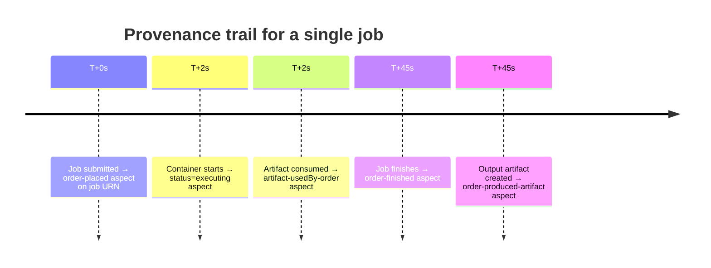

# Query Provenance History

IVCAP automatically records a complete, immutable provenance trail for every job,
artifact, and metadata change. This guide shows how to query that history.

---

## Setup

```python
from ivcap_client.ivcap import IVCAP

ivcap = IVCAP()   # reads IVCAP_URL, IVCAP_JWT, IVCAP_ACCOUNT_ID from environment
```

---

## How provenance works in IVCAP

Every significant event is recorded as an **aspect** — a typed, time-stamped metadata
record attached to an entity URN. Aspects are **append-only**: the platform never deletes
or overwrites history. The only modification allowed is *retracting* an aspect (setting
a `validTo` timestamp), which leaves the original record intact and queryable.



---

## Automatic provenance schemas

| Event | Schema URN | Content |
|---|---|---|
| Job submitted | `urn:ivcap:schema:order-placed.1` | Service, parameters, submitter |
| Job executing | `urn:ivcap:schema.job.2` | Status `executing`, timestamp |
| Artifact consumed | `urn:ivcap:schema:artifact-usedBy-order.1` | Artifact URN → Job URN |
| Artifact produced | `urn:ivcap:schema:order-produced-artifact.1` | Job URN → Artifact URN |
| Job completed | `urn:ivcap:schema:order-finished.1` | Final status, timestamp |

---

## List all aspects for a job

=== "CLI"

    ```bash
    ivcap aspect list --entity urn:ivcap:job:<uuid>
    ```

    ```
    +----+---------------------------------------------+----------------------+
    | ID | SCHEMA                                      | VALID FROM           |
    +----+---------------------------------------------+----------------------+
    | @1 | urn:ivcap:schema:order-placed.1             | 2025-06-01T10:00:00Z |
    | @2 | urn:ivcap:schema.job.2                      | 2025-06-01T10:00:02Z |
    | @3 | urn:ivcap:schema:order-produced-artifact.1  | 2025-06-01T10:00:45Z |
    | @4 | urn:ivcap:schema:order-finished.1           | 2025-06-01T10:00:45Z |
    +----+---------------------------------------------+----------------------+
    ```

=== "Python"

    ```python
    entity = "urn:ivcap:job:<uuid>"

    for aspect in ivcap.list_aspects(
        entity=entity,
        include_content=True,
        order_by="valid_from",
        order_direction="ASC",
    ):
        print(f"[{aspect.valid_from}] {aspect.schema}")
        if aspect.aspect:
            print(aspect.aspect)
    ```

=== "REST"

    ```bash
    GET /1/metadata?entity-id=urn:ivcap:job:<uuid>
    ```

---

## Find which job produced an artifact

=== "CLI"

    ```bash
    ivcap aspect list \
        --entity urn:ivcap:artifact:<uuid> \
        --schema urn:ivcap:schema:order-produced-artifact.1
    ```

=== "Python"

    ```python
    for aspect in ivcap.list_aspects(
        entity="urn:ivcap:artifact:<uuid>",
        schema="urn:ivcap:schema:order-produced-artifact.1",
        include_content=True,
    ):
        print(f"Produced by job: {aspect.aspect.get('job')}")
    ```

=== "REST"

    ```bash
    GET /1/metadata?entity-id=urn:ivcap:artifact:<uuid>&schema=urn:ivcap:schema:order-produced-artifact.1
    ```

---

## Find what a job produced

=== "Python"

    ```python
    for aspect in ivcap.list_aspects(
        entity="urn:ivcap:job:<uuid>",
        schema="urn:ivcap:schema:order-produced-artifact.1",
        include_content=True,
    ):
        print(f"Produced artifact: {aspect.aspect.get('artifact')}")
    ```

---

## Search aspects by schema across all entities

=== "Python"

    ```python
    # Find all completed jobs
    for m in ivcap.list_aspects(
        schema="urn:ivcap:schema:order-finished.1",
        include_content=False,
        limit=100,
    ):
        print(m)
    ```

    Filter with OData expressions:

    ```python
    filter = "collection~='urn:ivcap:collection:indo_flores'"
    for m in ivcap.list_aspects(
        schema="urn:common:schema:in_collection.1",
        filter=filter,
        include_content=True,
        limit=20,
    ):
        print(m)
        print(m.aspect)
    ```

=== "REST"

    ```bash
    GET /1/metadata?schema=urn:ivcap:schema:order-finished.1
    ```

---

## Point-in-time queries

Because aspects are never deleted, you can query the exact state of any entity at a
past moment:

=== "Python"

    ```python
    from datetime import datetime, timezone

    # What did we know about this artifact on 2025-01-01?
    past = datetime(2025, 1, 1, 1, 1, tzinfo=timezone.utc)

    for aspect in ivcap.list_aspects(
        entity="urn:ivcap:artifact:<uuid>",
        at_time=past,
        include_content=True,
    ):
        print(f"Valid from {aspect.valid_from}: {aspect.schema}")
        print(aspect.aspect)
    ```

=== "REST"

    ```bash
    GET /1/metadata?entity-id=urn:ivcap:artifact:<uuid>&at-time=2025-01-01T01:01:00Z
    ```

`at-time` returns aspects where `validFrom ≤ at-time` and `validTo` is unset or `> at-time`.

---

## Trace a full provenance chain

```python
import pprint
from ivcap_client.ivcap import IVCAP

ivcap = IVCAP()
pp = pprint.PrettyPrinter(indent=2)

ARTIFACT_URN = "urn:ivcap:artifact:6f390b51-..."

# Step 1 — which job produced this artifact?
producing_aspects = list(ivcap.list_aspects(
    entity=ARTIFACT_URN,
    schema="urn:ivcap:schema:order-produced-artifact.1",
    include_content=True,
))

if not producing_aspects:
    print("Artifact was uploaded directly (no producing job).")
else:
    job_urn = producing_aspects[0].aspect.get("job")
    print(f"Produced by job: {job_urn}")

    # Step 2 — what service and parameters?
    for aspect in ivcap.list_aspects(
        entity=job_urn,
        schema="urn:ivcap:schema:order-placed.1",
        include_content=True,
    ):
        sub = aspect.aspect
        print(f"\nService:    {sub.get('service')}")
        print(f"Submitter:  {sub.get('submitter')}")
        print("Parameters:")
        pp.pprint(sub.get("parameters", []))

    # Step 3 — what input artifacts did it consume?
    for aspect in ivcap.list_aspects(
        entity=job_urn,
        schema="urn:ivcap:schema:artifact-usedBy-order.1",
        include_content=True,
    ):
        print(f"\nInput artifact: {aspect.aspect.get('artifact')}")
```

---

## Add custom provenance aspects

```python
ivcap.add_aspect(
    entity="urn:ivcap:artifact:<uuid>",
    schema="urn:ivcap:schema:my-org:quality-review.1",
    aspect={
        "reviewer":    "urn:ivcap:account:<uuid>",
        "verdict":     "approved",
        "review-date": "2025-06-02",
    },
)
```

These aspects are stored alongside auto-recorded provenance and are queryable using the
same `entity`, `schema`, and `at_time` filters.

---

## REST API reference summary

| Method | Path | Description |
|---|---|---|
| `GET` | `/1/metadata` | Search aspects (`?entity-id=`, `?schema=`, `?at-time=`, `?filter=`) |
| `GET` | `/1/metadata/{id}` | Get a specific aspect by URN |
| `POST` | `/1/metadata` | Assert a new aspect |
| `PUT` | `/1/metadata/{id}` | Retract and replace an aspect |
| `DELETE` | `/1/metadata/{id}` | Retract an aspect (`validTo = now`) |

!!! note "API path vs CLI terminology"
    The REST API uses `/1/metadata` for what the CLI calls `ivcap aspect ...`.
    Both refer to the same Datafabric aspect records.

---

## Related concepts

- [Aspects and Provenance](../../concepts/aspects-and-provenance.md) — full data model
- [The Data Fabric](../../concepts/data-fabric.md) — the append-only store
- [Artifacts](../../concepts/artifacts.md) — artifact-specific provenance schemas

---

## Next steps

[→ Troubleshooting](troubleshooting.md){ .md-button .md-button--primary }
