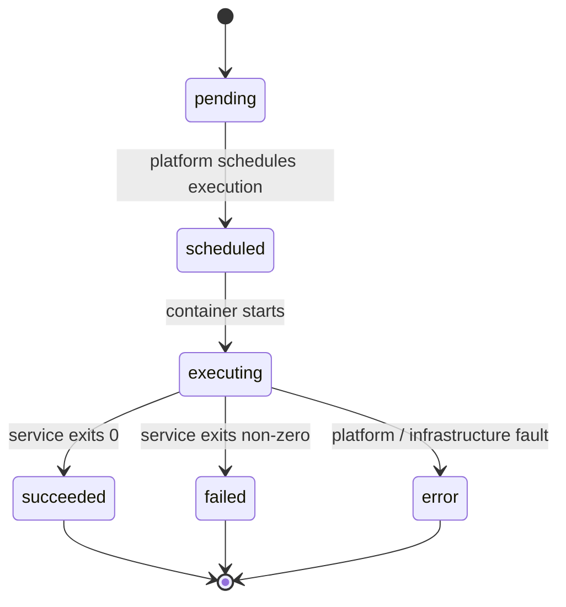

# Submit and Monitor Jobs

A **job** is a single execution of a service. You submit a job with a set of input
parameters, IVCAP schedules and runs it, and you retrieve the results when it's done.

---

## Before you submit

Make sure you have:

1. The service URN or name — see [Discover Services](discover-services.md)
2. Values for all required parameters
3. Artifact URNs for any `artifact`-type parameters — see [Work with Artifacts](work-with-artifacts.md)

---

## Submit a job

=== "CLI"

    ```bash
    ivcap order create urn:ivcap:service:<uuid> \
        region="Tasmania-North" \
        threshold=0.05 \
        --watch
    ```

    ```
            Name  fire-risk-xq7pf2
              ID  urn:ivcap:job:505c8573-... (@1)
          Status  succeeded
         Service  Fire Risk Analysis
    ```

=== "Python"

    The SDK provides a **request model** for each service. Create an instance with
    your parameter values, then call `svc.request_job()`:

    ```python
    import time
    from ivcap_client.ivcap import IVCAP
    from ivcap_client import JobStatus

    ivcap = IVCAP()

    # Look up the service
    svc = ivcap.get_service_by_name("Fire Risk Analysis")

    # Build the request model with your parameter values
    Model = svc.request_model
    job = svc.request_job(Model(
        region="Tasmania-North",
        threshold=0.05,
        # artifact input: input_data="urn:ivcap:artifact:...",
    ))

    print(f"Created job: {job.id}")

    # Poll until the job finishes
    while not job.finished:
        time.sleep(5)
        job.refresh()
        print(f"Status: {job.status()}")

    if job.status() == JobStatus.SUCCEEDED:
        print("Done!")
        print(job.result)
    else:
        print(f"Job ended with status: {job.status()}")
    ```

=== "REST (cURL)"

    ```bash
    curl -X POST https://api.example.ivcap.net/1/orders \
      -H "Authorization: Bearer $IVCAP_JWT" \
      -H "Content-Type: application/json" \
      -d '{
        "name": "tasmania-north-june-2025",
        "serviceID": "urn:ivcap:service:<uuid>",
        "accountID": "urn:ivcap:account:<uuid>",
        "parameters": [
          {"name": "region",    "value": "Tasmania-North"},
          {"name": "threshold", "value": "0.05"}
        ]
      }'
    ```

### Async variant

For non-blocking workflows, use the async API:

```python
import asyncio
from ivcap_client.ivcap import IVCAP

async def run():
    ivcap = IVCAP()
    svc = ivcap.get_service("urn:ivcap:service:<uuid>")

    req_model = await svc.request_model_async()
    passreq = req_model(region="Tasmania-North", threshold=0.05)

    # Submit and wait for result in one call
    job = await svc.request_job_async(passreq)
    result = await job.result_async()
    print(result)

asyncio.run(run())
```

---

## Monitor a running job

### Check status once

=== "CLI"

    ```bash
    ivcap order get urn:ivcap:job:505c8573-...
    ```

=== "Python"

    ```python
    # If you still have the job object:
    job.refresh()
    print(f"Status: {job.status()}")
    print(f"Finished: {job.finished}")
    ```

### List your recent jobs

=== "CLI"

    ```bash
    ivcap order list --limit 5
    ```

=== "Python"

    ```python
    for order in ivcap.list_orders(limit=5):
        print(order)
        for name, param in order.parameters.items():
            print(f"  {name}: {param.value}")
    ```

---

## Job lifecycle



| Status | Meaning |
|---|---|
| `pending` | Job record created; awaiting scheduling |
| `scheduled` | Execution environment is starting |
| `executing` | Service container is actively running |
| `succeeded` | Service completed successfully |
| `failed` | Service reported a failure |
| `error` | Platform-level failure |

---

## Retrieve job results

=== "CLI"

    ```bash
    ivcap order get @1
    ivcap artifact download @2 -f result.tiff
    ```

=== "Python"

    When `job.status() == JobStatus.SUCCEEDED`, access results via `job.result`:

    ```python
    from ivcap_client import JobStatus

    if job.status() == JobStatus.SUCCEEDED:
        result = job.result
        print(result)
    ```

---

## Complete Python example: submit, wait, and retrieve

```python
import time
from ivcap_client.ivcap import IVCAP
from ivcap_client import JobStatus

ivcap = IVCAP()

# 1. Get the service
svc = ivcap.get_service_by_name("Fire Risk Analysis")

# 2. Build request and submit
Model = svc.request_model
job = svc.request_job(Model(region="Tasmania-North", threshold=0.05))
print(f"Submitted: {job.id}")

# 3. Poll until done
while not job.finished:
    time.sleep(10)
    job.refresh()
    print(f"  → {job.status()}")

# 4. Handle result
if job.status() == JobStatus.SUCCEEDED:
    print("Success!")
    print(job.result)
else:
    raise RuntimeError(f"Job ended with status: {job.status()}")
```

---

## Handle a failed job

If a job has status `failed`, inspect its provenance aspects for error details:

=== "CLI"

    ```bash
    ivcap aspect list --entity urn:ivcap:job:<uuid>
    ```

=== "Python"

    ```python
    for aspect in ivcap.list_aspects(
        entity="urn:ivcap:job:<uuid>",
        schema="urn:ivcap:schema:order-finished.1",
        include_content=True,
    ):
        print(aspect.valid_from, aspect.schema)
        if aspect.aspect:
            print(aspect.aspect)
    ```

Common reasons for `failed`: missing required parameter, invalid value, artifact URN not
found, or domain-specific error from the service.

→ See [Troubleshooting](troubleshooting.md) for a full diagnostic checklist.

---

## Next steps

[→ Work with Artifacts](work-with-artifacts.md){ .md-button .md-button--primary }
[→ Query Provenance](query-provenance.md){ .md-button }
